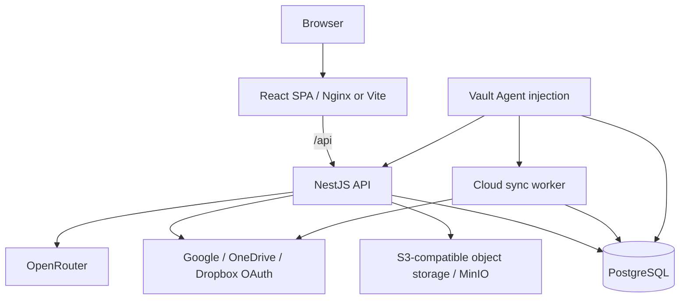
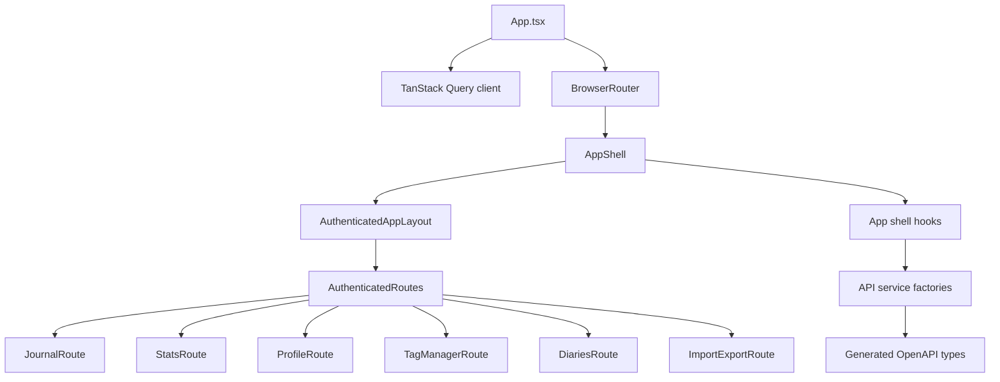
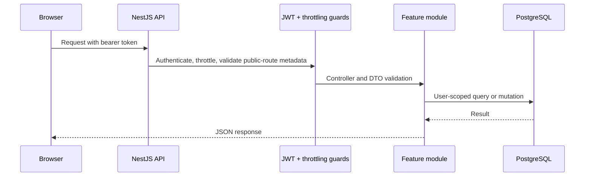
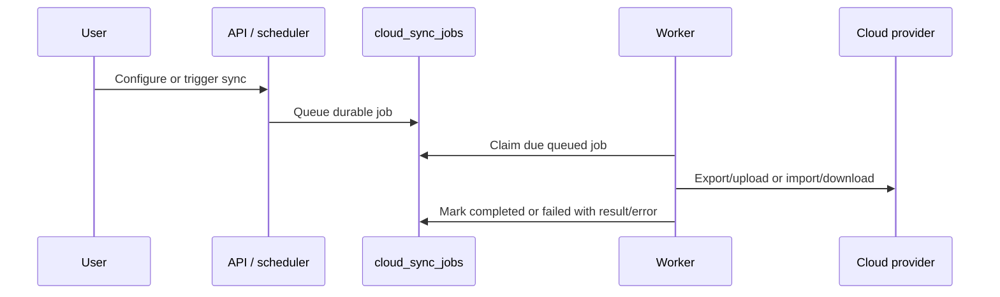

# Architecture Overview and ADR Index

This document is the entry point for Thoughty's architecture notes and architecture decision records (ADRs). It connects the major runtime and code-organization choices to the accepted ADRs that explain why those choices exist.

## System Architecture at a Glance

Thoughty is a TypeScript-first journaling product built as a modular monolith API plus a route-driven React single-page application. It stores journal metadata in PostgreSQL, stores attachment blobs in S3-compatible object storage, integrates with OpenRouter for optional AI features, and runs scheduled cloud sync work in a separate worker process backed by the same database.



## Backend Architecture

The backend is one NestJS application assembled from feature modules under `thoughty-server/src/modules`.

| Module        | Primary responsibility                                                                 |
| ------------- | -------------------------------------------------------------------------------------- |
| `auth`        | local auth, OAuth sign-in, access/refresh tokens, password recovery, account lifecycle |
| `entries`     | journal entry CRUD, revision history, tags, visibility, favorites, archive state       |
| `diaries`     | diary containers, default diary behavior, diary ordering and fallback rules            |
| `attachments` | attachment metadata, upload validation, object-storage retrieval                       |
| `ai`          | AI writing assistance, tag suggestions, tone/mood analysis, entry chat history         |
| `io`          | import, export, portability formats, cloud-sync serialization support                  |
| `stats`       | journal statistics and insight queries                                                 |
| `config`      | user preferences, profile/config export, encrypted integration settings                |
| `cloud-sync`  | provider connections, scheduled sync jobs, queueing, worker execution                  |

Shared runtime code belongs in `thoughty-server/src/common` only when it is genuinely cross-cutting. Persistence infrastructure and entities belong in `thoughty-server/src/database`. Operational helpers remain in `thoughty-server/scripts` rather than being mixed into runtime modules.

## Frontend Architecture

The frontend is one React SPA under `thoughty-web/src`. Its major boundary is route-driven rather than microfrontend-driven.



Route files stay thin, feature components own rendering detail, and hooks coordinate shared state, URL parameters, API calls, and cross-route behavior. Query-string semantics are product behavior for flows such as diary scope, import/export presets, and entry permalinks.

## Key Runtime Lifecycles

### Authenticated API request



### Cloud sync execution



## Data Ownership Rules

- `entries` owns entry lifecycle behavior; other modules should call its APIs/services instead of mutating entry rules ad hoc.
- `diaries` owns default-diary and delete-fallback semantics.
- `attachments` owns object-storage keys and file validation; entry modules should not treat original filenames as storage keys.
- `config` owns user preferences and encrypted integration settings.
- `cloud-sync` owns queued job status, locking, retries, and provider sync state.
- Public/social features are not implemented yet and should not reuse private-entry assumptions without a new ADR.

## ADR Process

Write or update an ADR when a change affects one or more of these areas:

- runtime topology or deployment ordering
- persistence model, ownership boundaries, or deletion behavior
- security, privacy, authentication, authorization, or abuse controls
- API contract strategy or frontend/backend integration boundaries
- background processing, queues, sync, or eventual consistency
- observability, backup, recovery, or production operations
- roadmap features that materially change the product shape, such as social feeds, real-time messaging, paywalls, or offline sync

Use `Proposed` for decisions that guide upcoming work but are not implemented yet, `Accepted` for implemented or committed architecture, and `Superseded` when a newer ADR replaces an older decision.

## Accepted ADRs

| ADR                                                          | Decision                                                                          |
| ------------------------------------------------------------ | --------------------------------------------------------------------------------- |
| [0001](./0001-documentation-structure.md)                    | Split detailed documentation out of the root README                               |
| [0002](./0002-modular-monolith-and-route-driven-ui.md)       | Adopt a modular monolith with a route-driven UI shell                             |
| [0003](./0003-typescript-first-technology-stack.md)          | Standardize on a TypeScript-first full-stack platform                             |
| [0004](./0004-openapi-as-contract-source.md)                 | Use backend OpenAPI as the source of truth for API contracts                      |
| [0005](./0005-selective-cqrs-in-entry-domain.md)             | Apply selective CQRS in the entry domain                                          |
| [0006](./0006-database-backed-cloud-sync-worker.md)          | Run scheduled cloud sync through a separate worker and database-backed queue      |
| [0007](./0007-code-quality-and-verification-gates.md)        | Keep code quality enforcement lightweight but continuous                          |
| [0008](./0008-security-authentication-and-owasp-baseline.md) | Establish a secure-by-default authentication and OWASP baseline                   |
| [0009](./0009-rate-limiting-and-abuse-controls.md)           | Apply layered rate limiting for baseline abuse resistance                         |
| [0010](./0010-journal-data-model.md)                         | Model the journal around diaries, dated entries, revisions, and attachments       |
| [0011](./0011-attachments-and-object-storage.md)             | Store attachment metadata in PostgreSQL and blobs in S3-compatible object storage |
| [0012](./0012-delivery-health-and-operational-model.md)      | Keep delivery and operational verification simple, explicit, and repository-owned |

## Proposed ADRs for Upcoming Roadmap Work

| ADR                                                     | Decision area                                       |
| ------------------------------------------------------- | --------------------------------------------------- |
| [0013](./0013-public-social-content-and-moderation.md)  | Public/social content and moderation model          |
| [0014](./0014-real-time-notifications-and-messaging.md) | Real-time notifications and private messaging model |
| [0015](./0015-observability-baseline.md)                | Observability baseline                              |
| [0016](./0016-backup-and-disaster-recovery.md)          | Backup and disaster recovery model                  |
| [0017](./0017-feature-flags-and-entitlements.md)        | Feature flags, AI paywall, trials, and entitlements |
| [0018](./0018-offline-and-mobile-sync.md)               | Offline/mobile sync model                           |

## ADR Template

```markdown
# ADR NNNN: Title

- Status: Proposed | Accepted | Superseded
- Date: YYYY-MM-DD

## Context

What problem, constraint, or opportunity requires a decision?

## Decision

What are we choosing?

## Rationale

Why is this choice better than the alternatives for Thoughty right now?

## Consequences

What does this make easier, harder, required, or explicitly deferred?
```