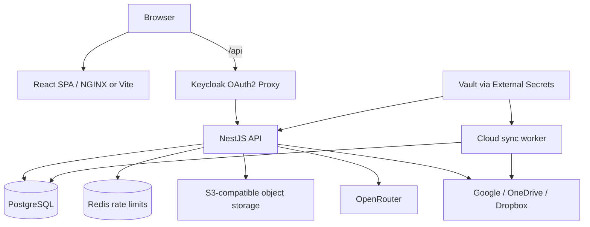
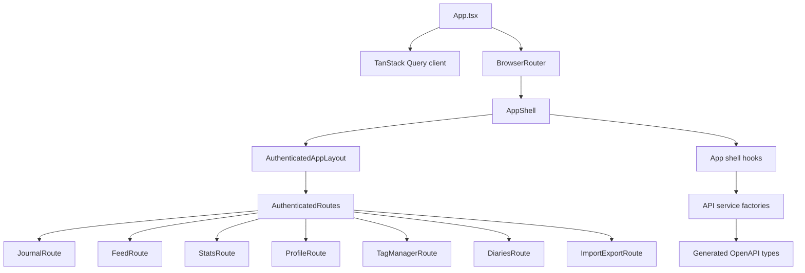
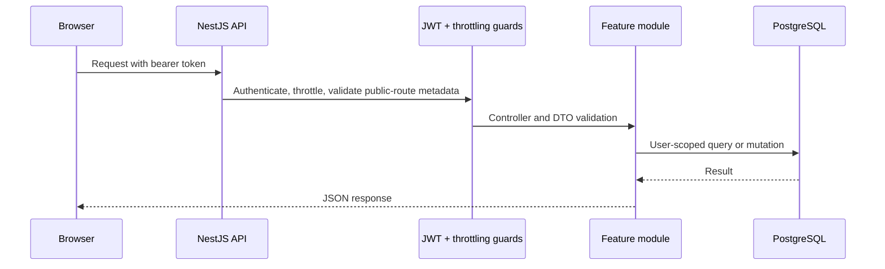
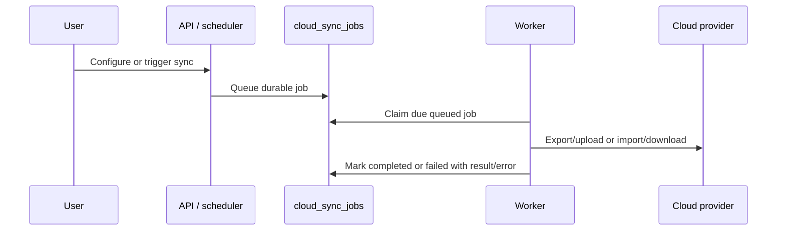

# Architecture Overview and ADR Index

How Thoughty is put together, and the architecture decision records (ADRs) that explain why. Entity-level detail is in the [Data Model](./data-model.md); runtime deployment is in the [Deployment Guide](./deployment.md).

## System Architecture at a Glance

Thoughty is a TypeScript-first modular monolith: one NestJS API and one route-driven React single-page application. PostgreSQL holds all journal data, S3-compatible object storage holds attachment blobs, Redis optionally shares rate-limit counters, OpenRouter provides optional AI, and a separate worker process runs scheduled cloud sync from a database-backed queue. In production, Keycloak authenticates users at the ingress and Vault supplies secrets.



## Backend Architecture

The backend is one NestJS application assembled from feature modules under `thoughty-server/src/modules`.

| Module | Responsibility |
|---|---|
| `auth` | SSO exchange, local and Google sign-in, tokens and sessions, email verification, 2FA, password recovery, account lifecycle |
| `entries` | entry CRUD, revisions, tags (usage, rename, delete), visibility, favorites, pins, archive, backlinks, public feed |
| `diaries` | diary containers, ordering, default diary and delete fallback |
| `attachments` | upload validation, object storage, audio transcription |
| `ai` | OpenRouter credentials and usage, tagging, inspiration, rephrasing, summaries, chat, semantic search, duplicates, theme organization, insights |
| `stats` | statistics, heatmap, connections graph, writing-tendency analysis |
| `io` | import and export formats, TXT format settings, delete-all |
| `books` | book composition, covers, previews, versions |
| `cloud-sync` | provider connections, file browsing, scheduled jobs, worker execution |
| `config` | user preferences and profile, encrypted settings, feature flags, data export |
| `feature-requests` | community idea board and votes |
| `metrics` | health and Prometheus metrics |

Shared runtime code belongs in `thoughty-server/src/common` only when it is genuinely cross-cutting. Persistence infrastructure and entities belong in `thoughty-server/src/database`. Operational helpers remain in `thoughty-server/scripts` rather than being mixed into runtime modules.

## Frontend Architecture

The frontend is one React SPA under `thoughty-web/src`. Its major boundary is route-driven rather than microfrontend-driven.



Route files stay thin, feature components own rendering, and hooks coordinate shared state, URL parameters, API calls, and cross-route behavior. Server state goes through TanStack Query; the entry list keeps the previous page on screen while the next one loads. Query-string parameters are product behavior (diary scope, import/export presets, entry permalinks). API types are generated from the server's OpenAPI document ([ADR 0004](./adr/0004-openapi-as-contract-source.md)), and a test fails if the frontend stops calling a documented product endpoint.

## Key Runtime Lifecycles

### Authenticated API request



### Cloud sync execution



## Data Ownership Rules

- `entries` owns entry lifecycle behavior; other modules should call its APIs/services instead of mutating entry rules ad hoc.
- `diaries` owns default-diary and delete-fallback semantics.
- `attachments` owns object-storage keys and file validation; entry modules should not treat original filenames as storage keys.
- `config` owns user preferences and encrypted integration settings.
- `cloud-sync` owns queued job status, locking, retries, and provider sync state.
- The public feed reads only entries that are both public and moderation-visible ([ADR 0013](./adr/0013-public-social-content-and-moderation.md)); new social features must not reuse private-entry assumptions without extending that ADR.
- Frequently repeated entry-list reads are served from a short-lived per-pod cache that entry mutations invalidate.

## ADR Process

Write or update an ADR when a change affects one or more of these areas:

- runtime topology or deployment ordering
- persistence model, ownership boundaries, or deletion behavior
- security, privacy, authentication, authorization, or abuse controls
- API contract strategy or frontend/backend integration boundaries
- background processing, queues, sync, or eventual consistency
- observability, backup, recovery, or production operations
- roadmap features that materially change the product shape, such as social feeds, real-time messaging, paywalls, or offline sync

Use `Proposed` for decisions that guide upcoming work but are not implemented yet, `Accepted` for implemented or committed architecture, and `Superseded` when a newer ADR replaces an older decision.

## Decision Records

| ADR | Status | Decision |
|---|---|---|
| [0001](./adr/0001-documentation-structure.md) | Accepted | Split Documentation Out of Root README |
| [0002](./adr/0002-modular-monolith-and-route-driven-ui.md) | Accepted | Adopt a Modular Monolith with a Route-Driven UI Shell and Feature-Oriented Code Structure |
| [0003](./adr/0003-typescript-first-technology-stack.md) | Accepted | Standardize on a TypeScript-First Full-Stack Platform |
| [0004](./adr/0004-openapi-as-contract-source.md) | Accepted | Use Backend OpenAPI as the Source of Truth for API Contracts |
| [0005](./adr/0005-selective-cqrs-in-entry-domain.md) | Accepted | Apply Selective CQRS in the Entry Domain |
| [0006](./adr/0006-database-backed-cloud-sync-worker.md) | Accepted | Run Scheduled Cloud Sync Through a Separate Worker and Database-Backed Queue |
| [0007](./adr/0007-code-quality-and-verification-gates.md) | Accepted | Keep Code Quality Enforcement Lightweight but Continuous |
| [0008](./adr/0008-security-authentication-and-owasp-baseline.md) | Accepted | Establish a Secure-by-Default Authentication and OWASP Baseline |
| [0009](./adr/0009-rate-limiting-and-abuse-controls.md) | Accepted | Apply Layered Rate Limiting for Baseline Abuse Resistance |
| [0010](./adr/0010-journal-data-model.md) | Accepted | Model the Journal Around Diaries, Dated Entries, Revisions, and Attachments |
| [0011](./adr/0011-attachments-and-object-storage.md) | Accepted | Store Attachments as Metadata in PostgreSQL and Blobs in S3-Compatible Object Storage |
| [0012](./adr/0012-delivery-health-and-operational-model.md) | Accepted | Keep Delivery and Operational Verification Simple, Explicit, and Repository-Owned |
| [0013](./adr/0013-public-social-content-and-moderation.md) | Accepted | Define Public Social Content and Moderation Before Building Feed Features |
| [0014](./adr/0014-real-time-notifications-and-messaging.md) | Proposed | Choose a Real-Time Notifications and Messaging Model Deliberately |
| [0015](./adr/0015-observability-baseline.md) | Accepted | Establish a Privacy-Aware Observability Baseline |
| [0016](./adr/0016-backup-and-disaster-recovery.md) | Accepted | Define Backup and Disaster Recovery for Journal Data |
| [0017](./adr/0017-feature-flags-and-entitlements.md) | Accepted | Separate Feature Flags from User Entitlements |
| [0018](./adr/0018-offline-and-mobile-sync.md) | Proposed | Decide Offline and Mobile Sync Before Building Mobile Apps |
| [0019](./adr/0019-explicit-delivery-jobs.md) | Accepted | Use Explicit Delivery Jobs and Non-Blocking Verification |

## ADR Template

```markdown
# ADR NNNN: Title

- Status: Proposed | Accepted | Superseded
- Date: YYYY-MM-DD

## Context

What problem, constraint, or opportunity requires a decision?

## Decision

What are we choosing?

## Rationale

Why is this choice better than the alternatives for Thoughty right now?

## Consequences

What does this make easier, harder, required, or explicitly deferred?
```
