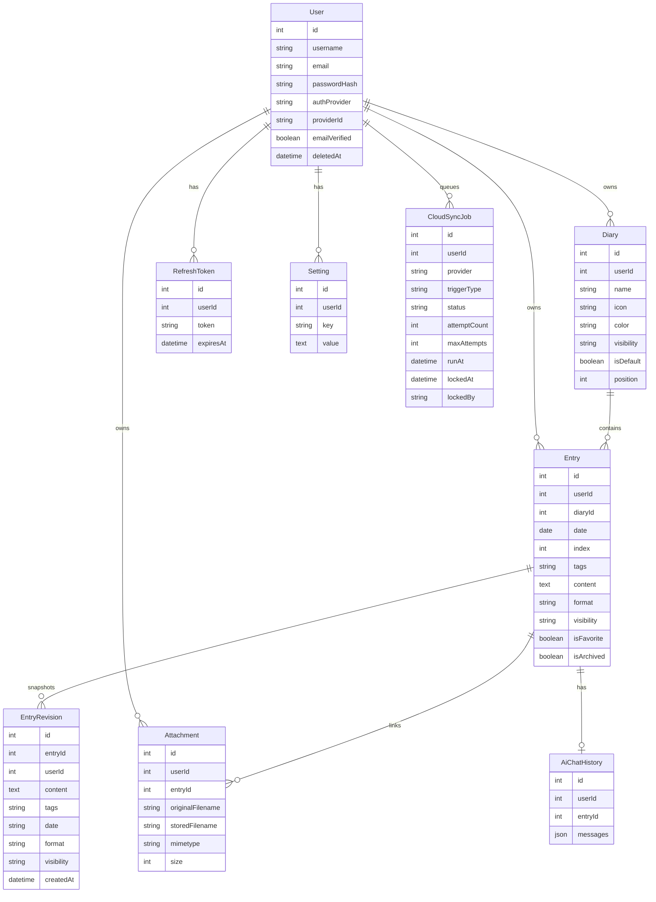

# Data Model Reference

This guide is the practical reference for Thoughty's current relational model. ADR 0010 explains the architectural decision; this file maps that decision to the entities and operational rules contributors need during implementation.

## Entity Relationship Overview

## Ownership and Deletion Rules

| Entity          | Ownership rule                                         | Deletion behavior                                                                                                                         |
| --------------- | ------------------------------------------------------ | ----------------------------------------------------------------------------------------------------------------------------------------- |
| `User`          | Root owner for private journal data                    | Accounts are soft-deleted at the application layer; user-owned rows use cascade relationships where hard deletion is performed            |
| `Diary`         | Owned by one user                                      | Hard deletion cascades from user; deleting a diary should move entries to the default diary when handled through the application workflow |
| `Entry`         | Owned by one user and optionally assigned to one diary | Hard deletion cascades attachments, revisions, and AI chat history                                                                        |
| `EntryRevision` | Snapshot for one entry and user                        | Deleted with the parent entry                                                                                                             |
| `Attachment`    | Owned by one user and optionally linked to one entry   | Database row is deleted with user/entry; object-store cleanup must be considered separately                                               |
| `Setting`       | Key/value setting for one user                         | Deleted with the user                                                                                                                     |
| `RefreshToken`  | Session continuation token for one user                | Deleted with the user; revoked by deleting stored rows during sensitive account events                                                    |
| `CloudSyncJob`  | Durable sync work item for one user/provider           | Deleted with the user in the SQL migration model                                                                                          |
| `AiChatHistory` | One chat transcript per user/entry pair                | Deleted with the parent entry                                                                                                             |

## Journal Coordinates

Entries are not only identified by database `id`. The user-facing journal model also treats `date` and same-day `index` as meaningful coordinates.

- `date` is a journal date, not just the date part of `created_at`.
- `index` distinguishes multiple entries on the same date.
- Entry permalinks use stable IDs, while cross-reference text can use date-plus-index forms such as `[[2024-01-15]]` and `[[2024-01-15#2]]`.
- Same-day drag reordering should preserve the date group and update indices consistently.

## Diary Rules

- Diary names are unique per user.
- One diary should act as the default capture target.
- The default diary is protected from deletion by the application workflow.
- When a non-default diary is deleted through the application workflow, entries should be moved to the current default diary instead of being stranded.
- `All Diaries` is a view concern, not a persisted diary row.

## Tags and Metadata

- Entry tags are currently stored directly on `entries.tags` as a PostgreSQL text array.
- Entry indexes are tuned for the most common journal reads: user/date timelines, diary-scoped timelines, visibility filters, archive/favorite filters, and tag containment through a PostgreSQL GIN index.
- Tag color/category metadata lives in user configuration rather than in a normalized tag table.
- Whole-app tag rename operations must update entry arrays and the metadata configuration together.
- If tags later need ownership, permissions, or rich relationships, this entry-centric model should be revisited with a new ADR.

## Attachments

- Attachment metadata lives in PostgreSQL.
- Blob contents live in S3-compatible object storage.
- `originalFilename` is display metadata; `storedFilename` is the generated object key.
- Attachments may be uploaded before final entry linkage and associated later.
- Object-store cleanup is a cross-resource concern and should be handled explicitly when attachment lifecycle behavior changes.

## Settings and Integration State

`settings` stores user-scoped key/value configuration. Some values are ordinary preferences, while cloud provider tokens and related integration secrets are encrypted before storage by the application using `CONFIG_ENCRYPTION_SECRET`.

Treat settings as user-owned application state, not as a general-purpose dumping ground. New setting groups should document their keys, value shape, and privacy impact.

## Migration Reality

The current repository uses `thoughty-server/scripts/migrate.ts`, an idempotent SQL migration helper, with TypeORM `synchronize: false`. The TypeORM data source is configured with a migrations path, but versioned TypeORM migration files are not yet the primary migration mechanism.

If the project moves to versioned TypeORM migrations, update this document, `docs/development.md`, `docs/deployment.md`, and ADR 0012 together.
