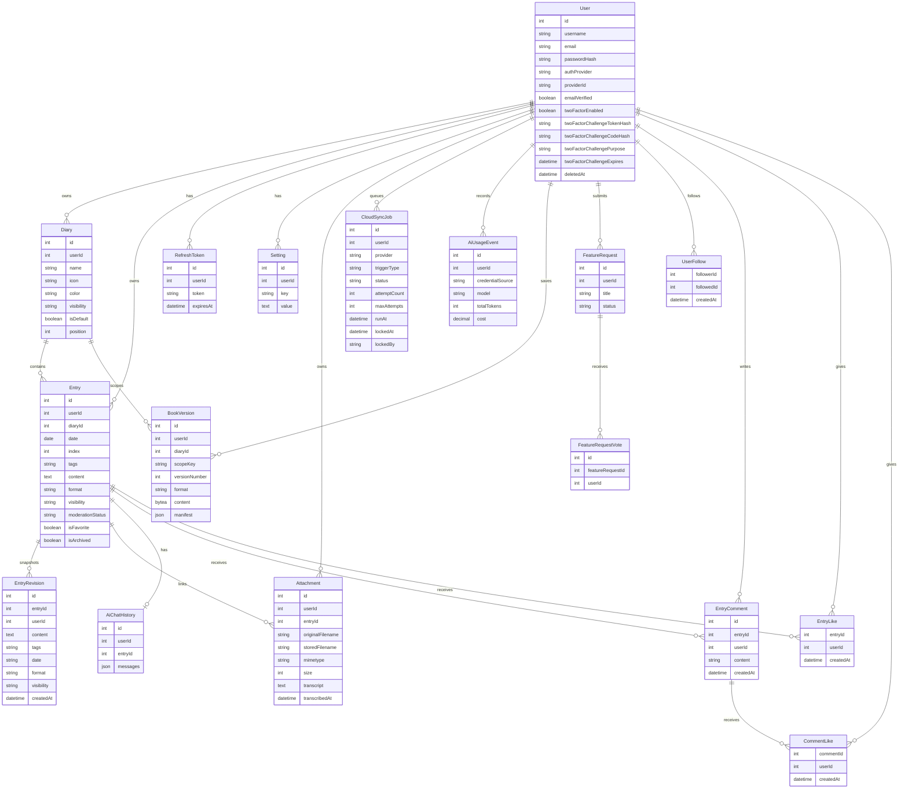

# Data Model Reference

The practical reference for Thoughty's relational model. [ADR 0010](./adr/0010-journal-data-model.md) explains the decision; this file lists the entities and the rules contributors must preserve. Entities live in `thoughty-server/src/database/entities`.

## Entity Relationship Overview

```mermaid
erDiagram
    User ||--o{ Diary : owns
    User ||--o{ Entry : owns
    User ||--o{ RefreshToken : has
    User ||--o{ Setting : has
    User ||--o{ Attachment : owns
    User ||--o{ CloudSyncJob : queues
    User ||--o{ AiUsageEvent : records
    User ||--o{ BookVersion : saves
    User ||--o{ FeatureRequest : submits
    FeatureRequest ||--o{ FeatureRequestVote : receives
    User ||--o{ UserFollow : follows
    User ||--o{ EntryComment : writes
    User ||--o{ EntryLike : gives
    User ||--o{ CommentLike : gives
    EntryComment ||--o{ CommentLike : receives

    Diary ||--o{ Entry : contains
    Diary ||--o{ BookVersion : scopes
    Entry ||--o{ EntryRevision : snapshots
    Entry ||--o{ Attachment : links
    Entry ||--o| AiChatHistory : has
    Entry ||--o{ EntryComment : receives
    Entry ||--o{ EntryLike : receives

    User {
        int id
        string username
        string email
        string passwordHash
        string authProvider
        string providerId
        boolean emailVerified
        boolean twoFactorEnabled
        string twoFactorChallengeTokenHash
        string twoFactorChallengeCodeHash
        string twoFactorChallengePurpose
        datetime twoFactorChallengeExpires
        datetime deletedAt
    }

    Diary {
        int id
        int userId
        string name
        string icon
        string color
        string visibility
        boolean isDefault
        int position
    }

    Entry {
        int id
        int userId
        int diaryId
        date date
        int index
        string tags
        text content
        string format
        string visibility
        string moderationStatus
        boolean isFavorite
        boolean isArchived
    }

    EntryRevision {
        int id
        int entryId
        int userId
        text content
        string tags
        string date
        string format
        string visibility
        datetime createdAt
    }

    Attachment {
        int id
        int userId
        int entryId
        string originalFilename
        string storedFilename
        string mimetype
        int size
        text transcript
        datetime transcribedAt
    }

    Setting {
        int id
        int userId
        string key
        text value
    }

    RefreshToken {
        int id
        int userId
        string token
        datetime expiresAt
    }

    CloudSyncJob {
        int id
        int userId
        string provider
        string triggerType
        string status
        int attemptCount
        int maxAttempts
        datetime runAt
        datetime lockedAt
        string lockedBy
    }

    AiChatHistory {
        int id
        int userId
        int entryId
        json messages
    }

    AiUsageEvent {
        int id
        int userId
        string credentialSource
        string model
        int totalTokens
        decimal cost
    }

    BookVersion {
        int id
        int userId
        int diaryId
        string scopeKey
        int versionNumber
        string format
        bytea content
        json manifest
    }

    FeatureRequest {
        int id
        int userId
        string title
        string status
    }

    FeatureRequestVote {
        int id
        int featureRequestId
        int userId
    }

    UserFollow {
        int followerId
        int followedId
        datetime createdAt
    }

    EntryComment {
        int id
        int entryId
        int userId
        string content
        datetime createdAt
    }

    EntryLike {
        int entryId
        int userId
        datetime createdAt
    }

    CommentLike {
        int commentId
        int userId
        datetime createdAt
    }
```

## Public Feed Eligibility

`Entry.visibility` and `Entry.moderationStatus` are independent. Visibility is the owner's explicit sharing choice; moderation status is a platform-controlled state with `visible`, `hidden`, `under_review`, and `removed` values. The public feed reads only entries where visibility and moderation are both `public`/`visible`, the entry is not archived, and its author is not deleted. The composite `idx_entries_public_feed` index supports these bounded, newest-first reads.

The feed queries the relational entry/user model directly and projects only feed-safe author fields. `UserFollow` is a separate relation keyed by `(follower_id, followed_id)`, with a check that nobody follows themselves and an index on `followed_id` for follower counts; the **Following** feed scope applies the same eligibility rules to followed authors only. A user can only be followed while they have at least one feed-eligible entry, so follows cannot probe private accounts. `EntryComment` holds plain-text comments of at most 1,000 non-blank characters; comments can only be read or written while their entry is feed-eligible, and comments by deleted users are neither listed nor counted. `EntryLike` and `CommentLike` allow one like per user and item (keyed by item and user); nobody can like their own entry or comment, likes follow the same feed-eligibility rule, and likes by deleted users are not counted. Report and enforcement records remain separate future entities rather than being encoded into entry ownership or visibility.

## Ownership and Deletion Rules

| Entity          | Ownership rule                                         | Deletion behavior                                                                                                                         |
| --------------- | ------------------------------------------------------ | ----------------------------------------------------------------------------------------------------------------------------------------- |
| `User`          | Root owner for private journal data                    | Accounts are soft-deleted at the application layer; user-owned rows use cascade relationships where hard deletion is performed            |
| `Diary`         | Owned by one user                                      | Hard deletion cascades from user; deleting a diary should move entries to the default diary when handled through the application workflow |
| `Entry`         | Owned by one user and optionally assigned to one diary | Hard deletion cascades attachments, revisions, and AI chat history                                                                        |
| `EntryRevision` | Snapshot for one entry and user                        | Deleted with the parent entry                                                                                                             |
| `Attachment`    | Owned by one user and optionally linked to one entry   | Database row, including any cached audio transcript, is deleted with user/entry; object-store cleanup must be considered separately       |
| `Setting`       | Key/value setting for one user                         | Deleted with the user                                                                                                                     |
| `RefreshToken`  | Session continuation token for one user                | Deleted with the user; revoked by deleting stored rows during sensitive account events                                                    |
| `CloudSyncJob`  | Durable sync work item for one user/provider           | Deleted with the user in the SQL migration model                                                                                          |
| `AiChatHistory` | One chat transcript per user/entry pair                | Deleted with the parent entry                                                                                                             |
| `AiUsageEvent`  | Numerical OpenRouter usage metadata for one user       | Deleted with the user; contains no prompt or completion content                                                                            |
| `BookVersion`   | Immutable generated book artifact in a user/diary scope | Deleted with the user or selected diary; all-diaries versions are deleted with the user                                                   |
| `FeatureRequest` / `FeatureRequestVote` | Public idea and one vote per user per idea | Requests are deleted with their author; votes with their request or voter |
| `UserFollow` | One follow per follower/followed pair | Deleted with either user; soft-deleted users are hidden from follow lists and follower counts |
| `EntryComment` | Written by one user on one entry | Deleted with the entry or its author; removable by its author or the entry owner |
| `EntryLike` / `CommentLike` | One like per user per entry or comment | Deleted with the liked item or the user |

Entry indexes cover the common reads: user/date timelines, diary-scoped timelines, visibility, archive and favorite filters, and the public feed.

## Journal Coordinates

Entries are not only identified by database `id`. The user-facing journal model also treats `date` and same-day `index` as meaningful coordinates.

- `date` is a journal date, not just the date part of `created_at`.
- `index` distinguishes multiple entries on the same date.
- Entry permalinks use stable IDs, while cross-reference text can use date-plus-index forms such as `[[2024-01-15]]` and `[[2024-01-15#2]]`.
- Same-day drag reordering should preserve the date group and update indices consistently.

## Diary Rules

- Diary names are unique per user.
- One diary should act as the default capture target.
- The default diary is protected from deletion by the application workflow.
- When a non-default diary is deleted through the application workflow, entries should be moved to the current default diary instead of being stranded.
- `All Diaries` is a view concern, not a persisted diary row.

## Tags and Metadata

There is no tag table. Tags are strings in the `entries.tags` PostgreSQL text array (GIN-indexed for containment filters), and per-user tag metadata (color and category, keyed by lowercase tag name) is a JSON value in the `tagMetadata` setting.

- The set of known tags is the union of tags used by entries and tags present in metadata. A tag created in the Tags view exists only as metadata until an entry uses it.
- `GET /api/entries/tags` returns each used tag with its entry count; `PATCH /api/entries/tags/rename` and `DELETE /api/entries/tags?tag=` rewrite every owned entry's array. The client updates the metadata setting alongside, so both stay consistent. Renaming a tag no entry uses only moves its metadata.
- There is no separate notion of themes: AI tagging, journal tag organization, and books all read and write the same tag arrays. A tag's **category** is different: it is an optional label (such as Work or Health) stored in tag metadata to group related tags in pickers, lists, and charts.
- Entry-to-entry and tag co-occurrence correlations are derived on demand from `entries.tags` and never persisted.
- If tags ever need their own ownership, permissions, or relationships, revisit this model with a new ADR.

## Attachments

- Attachment metadata lives in PostgreSQL.
- Blob contents live in S3-compatible object storage.
- `originalFilename` is display metadata; `storedFilename` is the generated object key.
- Attachments may be uploaded before final entry linkage and associated later.
- Object-store cleanup is a cross-resource concern and should be handled explicitly when attachment lifecycle behavior changes.

## Settings and Integration State

`settings` stores user-scoped key/value configuration. Some values are ordinary preferences, while cloud provider tokens, personal OpenRouter keys, and related integration secrets are encrypted before storage by the application using `CONFIG_ENCRYPTION_SECRET`. Personal OpenRouter keys are excluded from general configuration responses and user-data exports.

Treat settings as user-owned application state, not as a general-purpose dumping ground. New setting groups should document their keys, value shape, and privacy impact.

`ai_usage_events` stores request-level numerical accounting returned by OpenRouter. It records the user, whether the personal or server credential was used, model, token counts, cost, and timestamp. The table deliberately excludes prompts, completions, and credentials; the dashboard aggregates only personal-key events from the last 30 days.

## Book Versions

`book_versions` stores each saved generated book as an immutable binary artifact. A `scope_key` separates each diary's sequence from the all-diaries sequence, and `(user_id, scope_key, version_number)` is unique. Creation takes a PostgreSQL transaction-scoped advisory lock for that user and scope before assigning the next version number.

The JSON source manifest contains chapter titles and source entry IDs only. It supports added-entry and added-chapter comparisons without exposing journal content through history responses. The generated `BYTEA` artifact preserves the exact PDF, EPUB, HTML, or Markdown output and is excluded from ordinary TypeORM selects; download queries select it explicitly and always filter by the authenticated owner.

## Schema Migrations

The database schema is managed by ordered TypeORM migrations in `thoughty-server/src/database/migrations`; TypeORM `synchronize` remains disabled. `npm run db:migrate` initializes the application data source and applies every pending migration in one transaction.

`InitialSchema1784764800000` is an idempotent baseline of the schema that preceded migration history. On an existing Thoughty database, it verifies and fills any missing baseline objects before TypeORM records it in the `migrations` table. On a fresh database, it creates the complete baseline. Subsequent schema changes must be added as new timestamped migrations and must not edit a migration that has already shipped.

Generate a candidate migration with `npm run migration:generate -- src/database/migrations/<name>`, review both directions carefully, then test it against fresh and representative upgraded databases before deployment.

## Read Replicas

The TypeORM PostgreSQL connection supports optional read replicas through `POSTGRES_READ_REPLICA_HOSTS`. When one or more replica hosts are configured, TypeORM keeps writes on the primary `POSTGRES_HOST` connection and may route read queries to replica connections. Replica ports can be supplied with `POSTGRES_READ_REPLICA_PORTS`; replica user, password, and database values inherit the primary credentials unless `POSTGRES_READ_REPLICA_USER`, `POSTGRES_READ_REPLICA_PASSWORD`, or `POSTGRES_READ_REPLICA_DB` are set.

Operators should only enable replicas that are streaming from the primary with acceptable lag for journal, stats, search, and future feed reads. Migrations and write paths still target the primary database.
