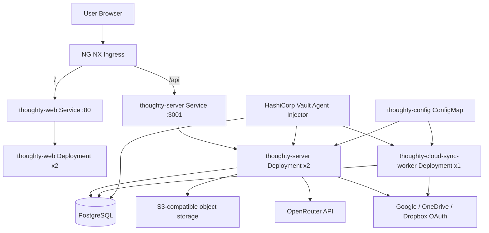
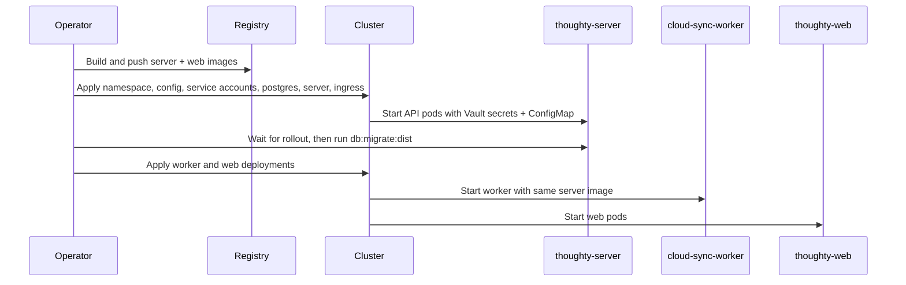
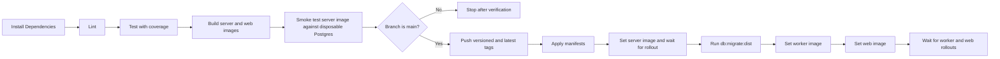

# Deployment Guide

This guide documents the deployment model that exists in this repository today: plain Kubernetes manifests under `deployments/`, Docker images built from the server and web projects, Vault Agent secret injection for backend workloads, and an optional Jenkins pipeline that automates the rollout.

## Runtime Topology

Thoughty deploys as four runtime surfaces inside the `thoughty` namespace:

- `thoughty-web`: Nginx serving the built React application on port `80`
- `thoughty-server`: NestJS API serving traffic on port `3001`
- `thoughty-cloud-sync-worker`: a dedicated background worker that runs `dist/src/cloud-sync-worker.js` from the same image as the API
- `postgres`: PostgreSQL `16-alpine` with a `5Gi` persistent volume claim



## What the Manifests Actually Configure

### Kubernetes Strategy and Probes

- `thoughty-server` runs `2` replicas with rolling updates using `maxSurge: 1` and `maxUnavailable: 0`
- `thoughty-web` runs `2` replicas with the same rolling update strategy
- `thoughty-cloud-sync-worker` runs `1` replica and also uses rolling updates
- `postgres` runs `1` replica with `Recreate`, which matches the single attached volume design
- The API now exposes `/api/health`, which matches the liveness and readiness probes in `deployments/server-deployment.yaml`
- The web deployment probes `/` on port `80`

### Image Model

- `thoughty-server/Dockerfile` builds a Node `22-alpine` image and starts `node dist/src/main.js`
- `thoughty-web/Dockerfile` builds the Vite app and serves it with `nginx:1.27-alpine`
- The cloud sync worker does not have its own image; it reuses the server image and overrides the command to run `node dist/src/cloud-sync-worker.js`
- The web image defaults `VITE_API_URL` to `/api`, which matches the ingress split between `/` and `/api`

### Networking Model

- The ingress host defaults to `thoughty.example.com` and must be replaced for real deployments
- `/api` routes to the API service on port `3001`
- `/` routes to the web service on port `80`
- The ingress annotations assume an NGINX ingress controller and currently enforce SSL redirect plus a `10m` body size

## Configuration and Secrets

Thoughty splits runtime configuration into two buckets:

- non-secret values in `deployments/configmap.yaml`
- secrets injected by Vault into backend and database pods

### ConfigMap Values Already Wired

These are loaded into the server and worker containers through `envFrom`:

| Variable        | Current source | Purpose                                          |
|-----------------|----------------|--------------------------------------------------|
| `NODE_ENV`      | ConfigMap      | Enables production behavior in NestJS            |
| `POSTGRES_HOST` | ConfigMap      | Points backend workloads at the PostgreSQL service |
| `POSTGRES_PORT` | ConfigMap      | Database port                                    |
| `CORS_ORIGIN`   | ConfigMap      | Allowed frontend origin list for the API         |
| `PORT`          | ConfigMap      | API listen port                                  |

### Vault Secrets Already Wired

These are injected through the Vault Agent templates in the manifests:

| Secret path                    | Used by                 | Variables                                                                 |
|--------------------------------|-------------------------|---------------------------------------------------------------------------|
| `secret/data/thoughty/database` | postgres, server, worker | `POSTGRES_USER`, `POSTGRES_PASSWORD`, `POSTGRES_DB`                       |
| `secret/data/thoughty/app`      | server, worker          | `JWT_SECRET`, `JWT_REFRESH_SECRET`, `GOOGLE_CLIENT_ID`, `GOOGLE_CLIENT_SECRET`, `SMTP_HOST`, `SMTP_PORT`, `SMTP_USER`, `SMTP_PASS` |

### Production Settings You Still Need To Wire For Optional Features

The application code supports more production features than the current Vault templates inject. If you plan to use these features in production, extend your secret injection before rollout:

| Feature                      | Required variables                                                                    | Why it matters                                                            |
|------------------------------|----------------------------------------------------------------------------------------|---------------------------------------------------------------------------|
| Attachments                  | `S3_ENDPOINT`, `S3_BUCKET`, `S3_ACCESS_KEY`, `S3_SECRET_KEY`, `S3_REGION`            | The attachments service falls back to local-dev MinIO defaults if these are missing |
| Cloud sync token encryption  | `CONFIG_ENCRYPTION_SECRET`                                                            | Without this, encrypted provider tokens fall back to a default secret that is not suitable for production |
| Cloud sync providers         | `ONEDRIVE_CLIENT_ID`, `ONEDRIVE_CLIENT_SECRET`, `DROPBOX_CLIENT_ID`, `DROPBOX_CLIENT_SECRET` | Provider auth flows require real credentials                              |
| AI features                  | `OPENROUTER_API_KEY`, optionally `OPENROUTER_TAG_MODEL`                               | AI endpoints return disabled or degraded behavior without a configured OpenRouter key |
| Email sender override        | `SMTP_FROM`                                                                           | Optional but useful if you do not want to send from `SMTP_USER`           |

The repo already contains the attachment, AI, and cloud sync code paths. The manifests simply need the remaining production secrets wired into Vault templates or another secret source before those features should be considered live in production.

## Recommended Manual Deployment Process

This is the shortest safe manual process that stays aligned with the manifests and with the rollout order used by Jenkins.



### 1. Prepare Cluster-Specific Values

Before any rollout, update the manifest values that are intentionally placeholders:

1. Set the real browser origin list in `deployments/configmap.yaml`.
2. Replace `thoughty.example.com` in `deployments/ingress.yaml` and enable TLS.
3. Decide whether you will edit image references in the manifests directly or patch them later with `kubectl set image`.
4. Extend Vault secrets and templates if you need attachments, cloud sync, or AI features in production.

### 2. Build and Push Images

```bash
# Server
cd thoughty-server
docker build -t <registry>/thoughty-server:<tag> .
docker push <registry>/thoughty-server:<tag>

# Web
cd ../thoughty-web
docker build -t <registry>/thoughty-web:<tag> .
docker push <registry>/thoughty-web:<tag>
```

If you want the deployed frontend to call a full external API URL instead of `/api`, pass `--build-arg VITE_API_URL=<url>` to the web build. The default `/api` is the correct choice when traffic flows through the provided ingress.

### 3. Configure Vault Roles and Secrets

The example commands in `deployments/vault-setup.sh` are consistent with the current manifests and service accounts. At minimum, configure:

- the Kubernetes auth method
- the `thoughty-server` role bound to the `thoughty-server` service account
- the `thoughty-postgres` role bound to the `thoughty-postgres` service account
- `secret/data/thoughty/database`
- `secret/data/thoughty/app`

If optional features are enabled, add the extra production variables described above and update the Vault templates in the manifests so the containers actually receive them.

### 4. Apply Base Resources

```bash
kubectl apply -f deployments/namespace.yaml
kubectl apply -f deployments/configmap.yaml
kubectl apply -f deployments/vault-service-accounts.yaml
kubectl apply -f deployments/postgres.yaml
kubectl apply -f deployments/server-deployment.yaml
kubectl apply -f deployments/ingress.yaml
```

Wait for PostgreSQL before expecting the API to come up cleanly:

```bash
kubectl rollout status deployment/postgres -n thoughty --timeout=120s
```

### 5. Point Deployments at the New Images

If you keep the manifest image fields generic and patch them at deploy time, use:

```bash
kubectl set image deployment/thoughty-server \
  thoughty-server=<registry>/thoughty-server:<tag> \
  -n thoughty
```

Wait for the API rollout before migrating:

```bash
kubectl rollout status deployment/thoughty-server -n thoughty --timeout=120s
```

### 6. Run Database Migrations Before Starting the Worker

This ordering matters. The Jenkins pipeline does it this way on purpose so the cloud sync worker does not start polling against an old schema.

```bash
kubectl exec deployment/thoughty-server -n thoughty -- npm run db:migrate:dist
```

### 7. Deploy the Worker and Web Surfaces

```bash
kubectl apply -f deployments/cloud-sync-worker-deployment.yaml
kubectl set image deployment/thoughty-cloud-sync-worker \
  thoughty-cloud-sync-worker=<registry>/thoughty-server:<tag> \
  -n thoughty

kubectl apply -f deployments/web-deployment.yaml
kubectl set image deployment/thoughty-web \
  thoughty-web=<registry>/thoughty-web:<tag> \
  -n thoughty
```

Then wait for both rollouts:

```bash
kubectl rollout status deployment/thoughty-cloud-sync-worker -n thoughty --timeout=120s
kubectl rollout status deployment/thoughty-web -n thoughty --timeout=120s
```

## Jenkins Deployment Flow

The `Jenkinsfile` implements the same deployment model with more guardrails.



### What Jenkins Verifies Before Production Rollout

- `npm ci` in both projects
- lint in both projects
- backend coverage run via `npm run test:cov`
- frontend coverage run via `npm run test:coverage`
- Docker builds for both runtime images
- a smoke test that boots a disposable PostgreSQL container and runs `npm run db:migrate:dist` inside the built server image

That smoke test is especially useful because it validates the exact server image artifact that will later be deployed.

## Operations Checklist After Rollout

Use these checks after either a manual rollout or a Jenkins deployment:

```bash
kubectl get pods -n thoughty
kubectl get ingress -n thoughty
kubectl logs deployment/thoughty-server -n thoughty --tail=100
kubectl logs deployment/thoughty-cloud-sync-worker -n thoughty --tail=100
kubectl exec deployment/thoughty-server -n thoughty -- wget -qO- http://localhost:3001/api/health
```

### What Good Looks Like

- PostgreSQL is `Running` and stable on a single pod
- both API replicas become `Ready`
- the worker starts only after schema migration completes
- the web deployment serves the built app through the ingress host
- the API returns a `200` from `/api/health`

## Manifest Reference

| File                                          | Responsibility                                              |
|-----------------------------------------------|-------------------------------------------------------------|
| `deployments/namespace.yaml`                  | Creates the `thoughty` namespace                            |
| `deployments/configmap.yaml`                  | Non-secret runtime configuration for backend workloads      |
| `deployments/vault-service-accounts.yaml`     | Service accounts used by Vault roles                        |
| `deployments/postgres.yaml`                   | PostgreSQL deployment, service, and persistent volume claim |
| `deployments/server-deployment.yaml`          | API deployment, service, probes, and Vault injection        |
| `deployments/cloud-sync-worker-deployment.yaml` | Dedicated background worker using the server image        |
| `deployments/web-deployment.yaml`             | Web deployment and service                                  |
| `deployments/ingress.yaml`                    | Host and path routing for `/` and `/api`                    |
| `deployments/vault-setup.sh`                  | Reference Vault bootstrap commands                          |

## Related Guides

- [Development Guide](./development.md)
- [Features](./features.md)