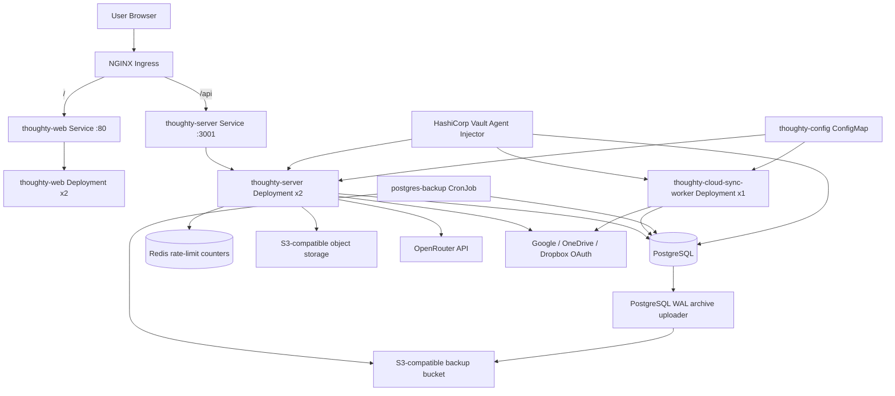
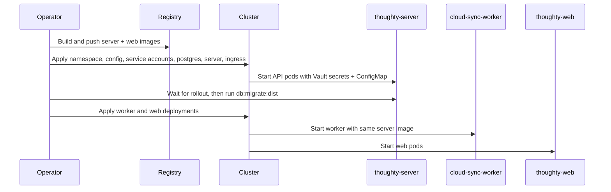
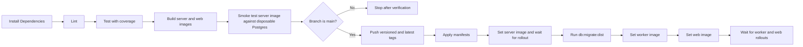

# Deployment Guide

This guide documents the deployment model that exists in this repository today: plain Kubernetes manifests under `deployments/`, Docker images built from the server and web projects, Vault Agent secret injection for backend workloads, and an optional Jenkins pipeline that automates the rollout.

## Runtime Topology

Thoughty deploys as runtime surfaces inside the `thoughty` namespace:

- `thoughty-web`: Nginx serving the built React application on port `80`
- `thoughty-server`: NestJS API serving traffic on port `3001`
- `thoughty-cloud-sync-worker`: a dedicated background worker that runs `dist/src/cloud-sync-worker.js` from the same image as the API
- `postgres`: PostgreSQL `16-alpine` with a `5Gi` persistent volume claim
- `postgres-backup`: a daily CronJob that writes encrypted-bucket-ready `pg_dump` snapshots and checksums to object storage
- `redis`: internal, ephemeral shared storage for API rate-limit counters



## What the Manifests Actually Configure

### Kubernetes Strategy and Probes

- `thoughty-server` runs `2` replicas with rolling updates using `maxSurge: 1` and `maxUnavailable: 0`
- `thoughty-web` runs `2` replicas with the same rolling update strategy
- `thoughty-cloud-sync-worker` runs `1` replica and also uses rolling updates
- `postgres` runs `1` replica with `Recreate`, which matches the single attached volume design
- `postgres` starts with WAL archiving enabled; a sidecar uploads archived WAL segments to object storage for point-in-time recovery windows
- `deployments/postgres-backup.yaml` creates a daily `postgres-backup` CronJob that uploads custom-format logical snapshots and SHA-256 checksum files
- `redis` runs `1` ephemeral replica for shared Nest throttler counters; losing it resets counters but does not lose user data
- `deployments/canary.yaml` adds optional canary API and web deployments plus an NGINX canary ingress; it starts at `0%` weighted traffic and can be exercised with the `X-Thoughty-Canary: always` request header
- The API now exposes `/api/health`, which matches the liveness and readiness probes in `deployments/server-deployment.yaml`
- The API exposes `/api/metrics` in Prometheus text format; the API pod template includes scrape annotations for clusters that honor `prometheus.io/*` annotations
- The web deployment probes `/` on port `80`

### Image Model

- `thoughty-server/Dockerfile` builds a Node `22-alpine` image and starts `node dist/src/main.js`
- `thoughty-web/Dockerfile` builds the Vite app and serves it with `nginx:1.27-alpine`
- The cloud sync worker does not have its own image; it reuses the server image and overrides the command to run `node dist/src/cloud-sync-worker.js`
- The web image defaults `VITE_API_URL` to `/api`, which matches the ingress split between `/` and `/api`

### Networking Model

- The ingress host defaults to `thoughty.example.com` and must be replaced for real deployments
- `/api` routes to the API service on port `3001`
- `/` routes to the web service on port `80`
- The ingress annotations assume an NGINX ingress controller and enforce SSL redirect plus a `10m` body size
- TLS is enabled through the `thoughty-tls` secret referenced by `deployments/ingress.yaml`

## Configuration and Secrets

Thoughty splits runtime configuration into two buckets:

- non-secret values in `deployments/configmap.yaml`
- secrets injected by Vault into backend and database pods

### ConfigMap Values Already Wired

These are loaded into the server and worker containers through `envFrom`:

| Variable               | Current source | Purpose                                             |
| ---------------------- | -------------- | --------------------------------------------------- |
| `NODE_ENV`             | ConfigMap      | Enables production behavior in NestJS               |
| `PORT`                 | ConfigMap      | API listen port                                     |
| `POSTGRES_HOST`        | ConfigMap      | Points backend workloads at the PostgreSQL service  |
| `POSTGRES_PORT`        | ConfigMap      | Database port                                       |
| `POSTGRES_READ_REPLICA_HOSTS` | ConfigMap | Optional comma-separated PostgreSQL replicas for read queries |
| `POSTGRES_READ_REPLICA_PORTS` | ConfigMap | Optional comma-separated replica ports matching `POSTGRES_READ_REPLICA_HOSTS` |
| `CORS_ORIGIN`          | ConfigMap      | Allowed frontend origin list for the API            |
| `FRONTEND_URL`         | ConfigMap      | Base URL used to build links in transactional email |
| `JWT_EXPIRES_IN`       | ConfigMap      | Access token lifetime                               |
| `S3_ENDPOINT`          | ConfigMap      | S3-compatible endpoint for attachments              |
| `S3_BUCKET`            | ConfigMap      | Attachment bucket name                              |
| `S3_REGION`            | ConfigMap      | Attachment bucket region                            |
| `POSTGRES_BACKUP_ENDPOINT` | ConfigMap  | S3-compatible endpoint for PostgreSQL backups       |
| `POSTGRES_BACKUP_BUCKET`   | ConfigMap  | PostgreSQL backup bucket name                       |
| `POSTGRES_BACKUP_REGION`   | ConfigMap  | PostgreSQL backup bucket region                     |
| `POSTGRES_BACKUP_BASE_PREFIX` | ConfigMap | Prefix for daily logical snapshots                |
| `POSTGRES_BACKUP_WAL_PREFIX`  | ConfigMap | Prefix for archived WAL segments                  |
| `REDIS_HOST`            | ConfigMap      | Redis service host for shared API rate limits      |
| `REDIS_PORT`            | ConfigMap      | Redis service port                                 |
| `REDIS_DB`              | ConfigMap      | Redis logical database index                       |
| `ENTRIES_CACHE_TTL_SECONDS` | ConfigMap  | Per-pod TTL for repeated entry-list responses      |
| `ENTRIES_CACHE_MAX_KEYS`    | ConfigMap  | Maximum per-pod entry-list cache keys              |
| `OPENROUTER_TAG_MODEL` | ConfigMap      | Default model for AI auto-tagging                   |

### Vault Secrets Already Wired

These are injected through the Vault Agent templates in the manifests. Populate the values in Vault (see `deployments/vault-setup.sh`) before rollout:

| Secret path                     | Used by                  | Variables                                                                                                                                                                                                                                                                                                                                 |
| ------------------------------- | ------------------------ | ----------------------------------------------------------------------------------------------------------------------------------------------------------------------------------------------------------------------------------------------------------------------------------------------------------------------------------------- |
| `secret/data/thoughty/database` | postgres, server, worker | `POSTGRES_USER`, `POSTGRES_PASSWORD`, `POSTGRES_DB`                                                                                                                                                                                                                                                                                       |
| `secret/data/thoughty/app`      | server, worker           | `JWT_SECRET`, `REFRESH_SECRET`, `CONFIG_ENCRYPTION_SECRET`, `S3_ACCESS_KEY`, `S3_SECRET_KEY`, `OPENROUTER_API_KEY`, `GOOGLE_DRIVE_CLIENT_ID`, `GOOGLE_DRIVE_CLIENT_SECRET`, `ONEDRIVE_CLIENT_ID`, `ONEDRIVE_CLIENT_SECRET`, `DROPBOX_CLIENT_ID`, `DROPBOX_CLIENT_SECRET`, `SMTP_HOST`, `SMTP_PORT`, `SMTP_USER`, `SMTP_PASS`, `SMTP_FROM` |
| `secret/data/thoughty/backup`   | postgres, backup job     | `POSTGRES_BACKUP_ACCESS_KEY`, `POSTGRES_BACKUP_SECRET_KEY`                                                                                                                                                                                                                                                                                |

The variable names match exactly what the server reads at runtime, including `REFRESH_SECRET` (refresh-token signing) and the `GOOGLE_DRIVE_*` cloud-sync client credentials.

### Feature-Specific Variables

Every variable below is already wired into the manifests. The remaining work is populating real values in Vault — empty values simply leave the feature disabled or in fallback mode:

| Feature                     | Variables                                                                                                                                            | Behavior when unset                                                                         |
| --------------------------- | ---------------------------------------------------------------------------------------------------------------------------------------------------- | ------------------------------------------------------------------------------------------- |
| Attachments                 | `S3_ACCESS_KEY`, `S3_SECRET_KEY` (secret); `S3_ENDPOINT`, `S3_BUCKET`, `S3_REGION` (ConfigMap)                                                       | The attachments service falls back to local-dev MinIO defaults                              |
| PostgreSQL backups          | `POSTGRES_BACKUP_ACCESS_KEY`, `POSTGRES_BACKUP_SECRET_KEY` (secret); `POSTGRES_BACKUP_*` endpoint, bucket, region, and prefixes (ConfigMap)          | Backup CronJob and WAL upload sidecar fail until configured                                 |
| Distributed throttling      | `REDIS_HOST`, `REDIS_PORT`, `REDIS_DB` or `REDIS_URL`; optional `REDIS_PASSWORD`, `REDIS_TLS`                                                         | API falls back to process-local throttling when Redis is not configured or temporarily unavailable |
| Cloud sync token encryption | `CONFIG_ENCRYPTION_SECRET`                                                                                                                           | Encrypted provider tokens fall back to a default secret that is not suitable for production |
| Cloud sync providers        | `GOOGLE_DRIVE_CLIENT_ID`, `GOOGLE_DRIVE_CLIENT_SECRET`, `ONEDRIVE_CLIENT_ID`, `ONEDRIVE_CLIENT_SECRET`, `DROPBOX_CLIENT_ID`, `DROPBOX_CLIENT_SECRET` | Provider auth flows are unavailable                                                         |
| AI features                 | `OPENROUTER_API_KEY` (secret); `OPENROUTER_TAG_MODEL` (ConfigMap)                                                                                    | AI endpoints return disabled or degraded behavior                                           |
| Email sender override       | `SMTP_FROM`                                                                                                                                          | Falls back to sending from `SMTP_USER`                                                      |
| PostgreSQL read replicas    | `POSTGRES_READ_REPLICA_HOSTS`, optional `POSTGRES_READ_REPLICA_PORTS`, optional `POSTGRES_READ_REPLICA_USER`, `POSTGRES_READ_REPLICA_PASSWORD`, `POSTGRES_READ_REPLICA_DB` | TypeORM routes reads to the primary database when replica hosts are empty |

The frontend Google sign-in client ID is baked into the web image at build time via the `VITE_GOOGLE_CLIENT_ID` Docker build argument, not through Vault. Pass it with `--build-arg VITE_GOOGLE_CLIENT_ID=<id>` (the Jenkins pipeline forwards a `VITE_GOOGLE_CLIENT_ID` environment variable for this).

## Recommended Manual Deployment Process

This is the shortest safe manual process that stays aligned with the manifests and with the rollout order used by Jenkins.



### 1. Prepare Cluster-Specific Values

Before any rollout, update the manifest values that are intentionally placeholders:

1. Set the real browser origin list (`CORS_ORIGIN`), `FRONTEND_URL`, attachment S3 endpoint/bucket/region, and PostgreSQL backup endpoint/bucket/region in `deployments/configmap.yaml`.
2. Replace `thoughty.example.com` in `deployments/ingress.yaml` and create or provision the `thoughty-tls` TLS secret for that host.
3. Decide whether you will edit image references in the manifests directly or patch them later with `kubectl set image`.
4. Populate the secret values in Vault. The manifests already inject every secret the application reads; you only need to provide real values for the features you enable.

### 2. Build and Push Images

```bash
# Server
cd thoughty-server
docker build -t <registry>/thoughty-server:<tag> .
docker push <registry>/thoughty-server:<tag>

# Web
cd ../thoughty-web
docker build \
  --build-arg VITE_GOOGLE_CLIENT_ID=<google-client-id> \
  -t <registry>/thoughty-web:<tag> .
docker push <registry>/thoughty-web:<tag>
```

If you want the deployed frontend to call a full external API URL instead of `/api`, also pass `--build-arg VITE_API_URL=<url>` to the web build. The default `/api` is the correct choice when traffic flows through the provided ingress. The `VITE_GOOGLE_CLIENT_ID` build argument is optional and only required if you want Google sign-in in the deployed frontend.

### 3. Configure Vault Roles and Secrets

The example commands in `deployments/vault-setup.sh` are consistent with the current manifests and service accounts. At minimum, configure:

- the Kubernetes auth method
- the `thoughty-server` role bound to the `thoughty-server` service account
- the `thoughty-postgres` role bound to the `thoughty-postgres` service account
- `secret/data/thoughty/database`
- `secret/data/thoughty/app`

The Vault templates in the manifests already export the full set of application secrets, so once the values exist in Vault the containers receive them automatically. Leave values for optional features empty to keep those features disabled.

### 4. Apply Base Resources

Create the TLS secret before applying the ingress, unless your cluster uses cert-manager or another controller that creates the same secret automatically:

```bash
kubectl create secret tls thoughty-tls \
  --cert=/path/to/tls.crt \
  --key=/path/to/tls.key \
  -n thoughty
```

```bash
kubectl apply -f deployments/namespace.yaml
kubectl apply -f deployments/configmap.yaml
kubectl apply -f deployments/vault-service-accounts.yaml
kubectl apply -f deployments/redis.yaml
kubectl apply -f deployments/postgres.yaml
kubectl apply -f deployments/postgres-backup.yaml
kubectl apply -f deployments/server-deployment.yaml
kubectl apply -f deployments/monitoring-alerts.yaml
kubectl apply -f deployments/ingress.yaml
```

Wait for PostgreSQL before expecting the API to come up cleanly:

```bash
kubectl rollout status deployment/postgres -n thoughty --timeout=120s
```

### 5. Point Deployments at the New Images

If you keep the manifest image fields generic and patch them at deploy time, use:

```bash
kubectl set image deployment/thoughty-server \
  thoughty-server=<registry>/thoughty-server:<tag> \
  -n thoughty
```

Wait for the API rollout before migrating:

```bash
kubectl rollout status deployment/thoughty-server -n thoughty --timeout=120s
```

### 6. Run Database Migrations Before Starting the Worker

This ordering matters. The Jenkins pipeline does it this way on purpose so the cloud sync worker does not start polling against an old schema.

```bash
kubectl exec deployment/thoughty-server -n thoughty -- /bin/sh -c \
  'source /vault/secrets/database && source /vault/secrets/app && npm run db:migrate:dist'
```

The Vault secrets must be sourced explicitly because `kubectl exec` starts a fresh shell that does not run the container's startup command.

### 7. Deploy the Worker and Web Surfaces

```bash
kubectl apply -f deployments/cloud-sync-worker-deployment.yaml
kubectl set image deployment/thoughty-cloud-sync-worker \
  thoughty-cloud-sync-worker=<registry>/thoughty-server:<tag> \
  -n thoughty

kubectl apply -f deployments/web-deployment.yaml
kubectl set image deployment/thoughty-web \
  thoughty-web=<registry>/thoughty-web:<tag> \
  -n thoughty
```

Then wait for both rollouts:

```bash
kubectl rollout status deployment/thoughty-cloud-sync-worker -n thoughty --timeout=120s
kubectl rollout status deployment/thoughty-web -n thoughty --timeout=120s
```

## Optional Canary Rollout

Use `deployments/canary.yaml` when you want a zero-downtime release gate before promoting the main API and web deployments. The canary runs separate API and web pods behind dedicated services and an NGINX canary ingress. The cloud sync worker is intentionally excluded because running stable and canary workers at the same time could double-process queued jobs.

Apply the canary and point it at candidate images:

```bash
kubectl apply -f deployments/canary.yaml
kubectl set image deployment/thoughty-server-canary \
  thoughty-server=<registry>/thoughty-server:<candidate-tag> \
  -n thoughty
kubectl set image deployment/thoughty-web-canary \
  thoughty-web=<registry>/thoughty-web:<candidate-tag> \
  -n thoughty
kubectl rollout status deployment/thoughty-server-canary -n thoughty --timeout=120s
kubectl rollout status deployment/thoughty-web-canary -n thoughty --timeout=120s
```

The canary ingress starts with `nginx.ingress.kubernetes.io/canary-weight: "0"`, so normal user traffic stays on stable. Send a header-routed smoke request through the public host:

```bash
curl -H 'X-Thoughty-Canary: always' https://thoughty.example.com/api/health
```

After smoke checks pass, shift a small percentage of traffic:

```bash
kubectl annotate ingress thoughty-canary-ingress \
  -n thoughty \
  nginx.ingress.kubernetes.io/canary-weight="10" \
  --overwrite
```

Promote by updating the stable deployments to the candidate tags, waiting for rollout, running migrations from the promoted server image when needed, then updating the worker:

```bash
kubectl set image deployment/thoughty-server \
  thoughty-server=<registry>/thoughty-server:<candidate-tag> \
  -n thoughty
kubectl rollout status deployment/thoughty-server -n thoughty --timeout=120s
kubectl exec deployment/thoughty-server -n thoughty -- /bin/sh -c \
  'source /vault/secrets/database && source /vault/secrets/app && npm run db:migrate:dist'
kubectl set image deployment/thoughty-web \
  thoughty-web=<registry>/thoughty-web:<candidate-tag> \
  -n thoughty
kubectl set image deployment/thoughty-cloud-sync-worker \
  thoughty-cloud-sync-worker=<registry>/thoughty-server:<candidate-tag> \
  -n thoughty
```

Rollback canary traffic by setting the canary weight back to `0` or deleting the canary resources:

```bash
kubectl annotate ingress thoughty-canary-ingress \
  -n thoughty \
  nginx.ingress.kubernetes.io/canary-weight="0" \
  --overwrite
kubectl delete -f deployments/canary.yaml
```

## Jenkins Deployment Flow

The `Jenkinsfile` implements the same deployment model with more guardrails.



### What Jenkins Verifies Before Production Rollout

- `npm ci` in both projects
- lint in both projects
- backend coverage run via `npm run test:cov`
- frontend coverage run via `npm run test:coverage`
- dependency vulnerability scans via `npm audit --audit-level=high` in both projects
- Docker builds for both runtime images
- a smoke test that boots a disposable PostgreSQL container and runs `npm run db:migrate:dist` inside the built server image
- a daily scheduled run of the full verification pipeline, including Playwright browser tests

That smoke test is especially useful because it validates the exact server image artifact that will later be deployed.

## Operations Checklist After Rollout

Use these checks after either a manual rollout or a Jenkins deployment:

```bash
kubectl get pods -n thoughty
kubectl get ingress -n thoughty
kubectl logs deployment/thoughty-server -n thoughty --tail=100
kubectl logs deployment/thoughty-cloud-sync-worker -n thoughty --tail=100
kubectl exec deployment/thoughty-server -n thoughty -- wget -qO- http://localhost:3001/api/health
kubectl exec deployment/thoughty-server -n thoughty -- wget -qO- http://localhost:3001/api/metrics | head
```

### What Good Looks Like

- PostgreSQL is `Running` and stable on a single pod
- both API replicas become `Ready`
- the worker starts only after schema migration completes
- the web deployment serves the built app through the ingress host
- the API returns a `200` from `/api/health`
- `/api/metrics` includes `thoughty_database_up 1`, request counters after traffic, privacy-preserving feature usage counters, and cloud sync queue gauges

## Manifest Reference

| File                                            | Responsibility                                              |
| ----------------------------------------------- | ----------------------------------------------------------- |
| `deployments/namespace.yaml`                    | Creates the `thoughty` namespace                            |
| `deployments/configmap.yaml`                    | Non-secret runtime configuration for backend workloads      |
| `deployments/vault-service-accounts.yaml`       | Service accounts used by Vault roles                        |
| `deployments/redis.yaml`                        | Internal Redis deployment and service for rate limiting      |
| `deployments/postgres.yaml`                     | PostgreSQL deployment, service, and persistent volume claim |
| `deployments/postgres-backup.yaml`              | Daily PostgreSQL backup CronJob                             |
| `deployments/server-deployment.yaml`            | API deployment, service, probes, and Vault injection        |
| `deployments/cloud-sync-worker-deployment.yaml` | Dedicated background worker using the server image          |
| `deployments/canary.yaml`                       | Optional API/web canary deployments and NGINX canary ingress |
| `deployments/monitoring-alerts.yaml`            | PrometheusRule alerts for API, database, and cloud sync health |
| `deployments/web-deployment.yaml`               | Web deployment and service                                  |
| `deployments/ingress.yaml`                      | Host and path routing for `/` and `/api`                    |
| `deployments/vault-setup.sh`                    | Reference Vault bootstrap commands                          |

## Related Guides

- [Development Guide](./development.md)
- [Features](./features.md)
