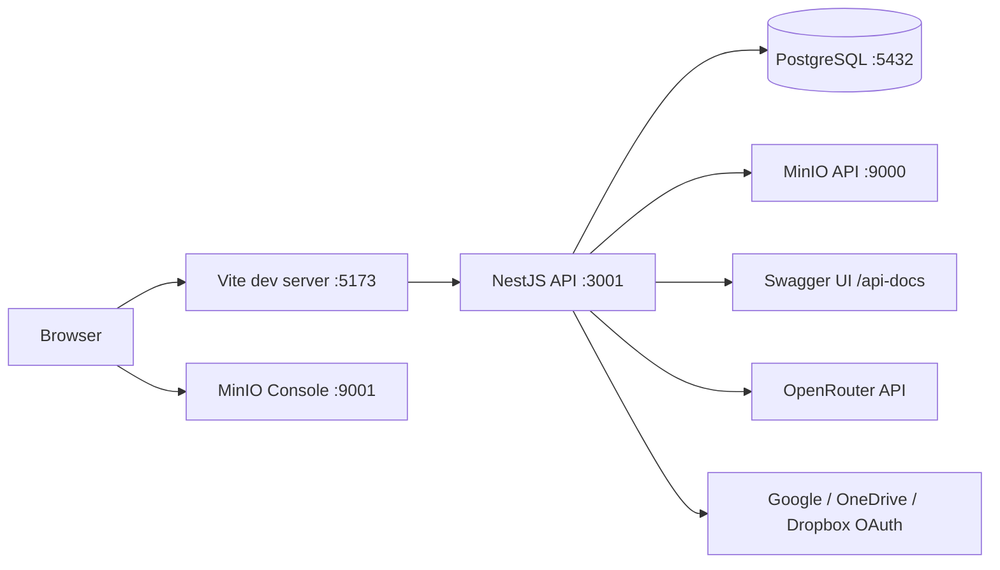
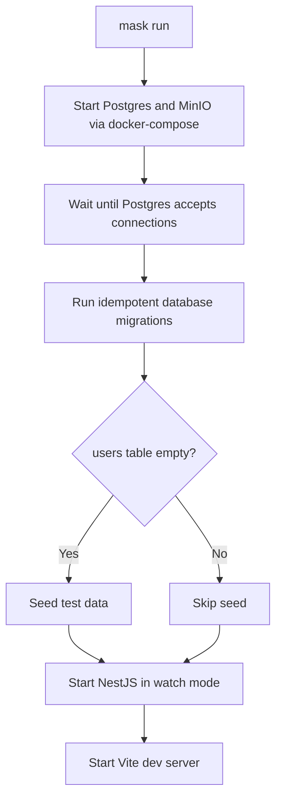
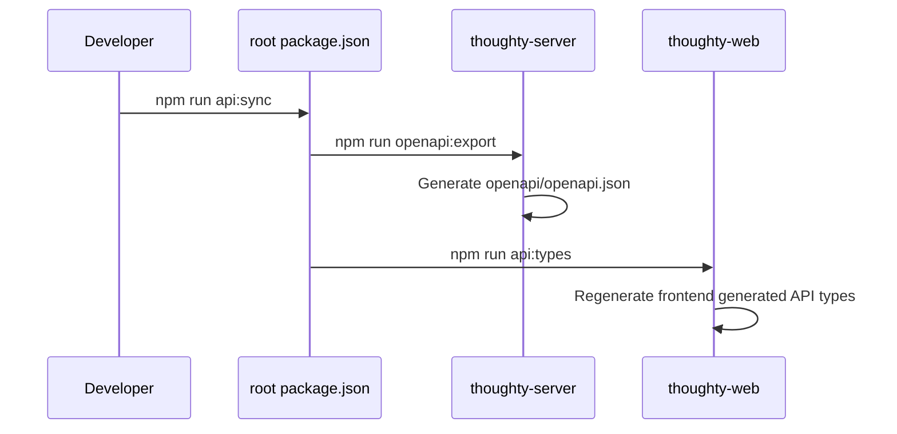

# Development Guide

This guide describes the local development workflow that the repository actually supports today: a NestJS API, a Vite React frontend, PostgreSQL and MinIO from Docker Compose, and a `mask` task runner that handles the common boot flow.

## Local Topology



## Recommended Baseline

- Node.js `22` is the safest local baseline because the Dockerfiles and Jenkins pipeline both use Node `22-alpine`
- Docker and Docker Compose are required for PostgreSQL and local MinIO
- [`mask`](https://github.com/jacobdeichert/mask) is optional, but it is the intended entry point for the common workflows

If you prefer not to install `mask`, every major workflow also has direct `npm` commands.

## Fastest Path to a Running App

### 1. Install dependencies

```bash
mask build
```

Manual equivalent:

```bash
cd thoughty-server && npm install && cd ..
cd thoughty-web && npm install && cd ..
```

### 2. Create local env files if you need overrides

Both projects already include example env files:

- `thoughty-server/.env.example`
- `thoughty-web/.env.example`

For the default local stack, you do not need many overrides. Copy the examples only when you need to change defaults or enable optional integrations.

### 3. Start the full local stack

```bash
mask run
```

That single command is more than a process launcher.



### Local URLs

| Surface       | URL                              |
| ------------- | -------------------------------- |
| Frontend      | `http://localhost:5173`          |
| Backend API   | `http://localhost:3001`          |
| Swagger UI    | `http://localhost:3001/api-docs` |
| PostgreSQL    | `localhost:5432`                 |
| MinIO API     | `http://localhost:9000`          |
| MinIO Console | `http://localhost:9001`          |

## Manual Startup Flow

Use the manual path when you want tighter control than `mask run` provides.

### Infrastructure only

```bash
docker-compose -f .devcontainer/docker-compose.yml up -d db minio
```

### Database prep

```bash
npm run migrate
npm run seed
```

### Start backend and frontend separately

Use two terminals for this path.

```bash
cd thoughty-server && npm run dev
cd thoughty-web && npm run dev
```

This manual path is useful when you do not want automatic seeding or when you want to restart one surface without touching the others.

## VS Code Dev Container Alternative

The repository also includes a complete `.devcontainer/` setup for VS Code.

### What the devcontainer gives you

- a dedicated `app` workspace container mounted at `/workspace`, on the same Node `22` baseline as the Dockerfiles and CI
- companion `db` and `minio` services from the same Compose file, both gated on health checks
- automatic dependency installation (root, server, and web) through `postCreateCommand`
- container-to-container env wired automatically (`POSTGRES_HOST=db`, `S3_ENDPOINT=http://minio:9000`, and the matching credentials), so no manual `.env` is required
- forwarded ports for `3001`, `5173`, `5432`, `9000`, and `9001`
- `mask`, `git`, `wget`, `unzip`, `postgresql-client`, and the GitHub CLI preinstalled in the workspace container
- preconfigured VS Code extensions (ESLint, Prettier, Tailwind, Jest, Playwright, YAML, Docker, GitHub PRs) and format-on-save

### How to start it

1. Open the repository in VS Code.
2. Use the Dev Containers extension.
3. Run `Dev Containers: Reopen in Container`.
4. Wait for the post-create step to finish installing `thoughty-server` and `thoughty-web` dependencies.

### Important difference from host-based development

Inside the devcontainer, the supporting services are already part of the Compose stack, and the workspace container does not install Docker Compose tooling itself. That means the normal host shortcut `mask run` is not the best entry point from inside the container.

Instead, run the application manually from the container terminal.

### Container-to-container networking is already wired

When the backend runs inside the `app` container, `localhost` points to that container, not to PostgreSQL or MinIO. The devcontainer Compose file sets the required overrides (`POSTGRES_HOST=db`, `S3_ENDPOINT=http://minio:9000`, and the matching credentials) directly on the `app` service, so the backend connects to the companion services out of the box.

You only need to create `thoughty-server/.env` if you want to enable optional integrations like SMTP, OpenRouter, or cloud provider OAuth. The container-level values above take effect automatically and survive even if you add an `.env` for other settings, as long as you do not override `POSTGRES_HOST` or `S3_ENDPOINT` there.

### Start the app from inside the container

Run these commands in the devcontainer terminal.

Use two terminals for the dev servers after the shared setup commands finish.

```bash
npm run migrate
npm run seed
cd thoughty-server && npm run dev
cd thoughty-web && npm run dev
```

The web dev server still proxies `/api` to `http://localhost:3001`, which works in this setup because the frontend and backend both run inside the same `app` container.

### When to prefer the devcontainer path

- when you want a containerized Node toolchain instead of managing local Node yourself
- when you want the workspace dependencies installed consistently through VS Code
- when you are already using Dev Containers for the rest of your workflow

## Environment Files

The `.env.example` files are the source of truth for local configuration. The table below focuses on what matters most during day-to-day development.

### Server env highlights

| Variable group             | Typical local value                                    | Notes                                                    |
| -------------------------- | ------------------------------------------------------ | -------------------------------------------------------- |
| Database                   | `localhost:5432` / `postgres` / `password` / `journal` | Matches `.devcontainer/docker-compose.yml`               |
| JWT                        | local placeholders                                     | Required for auth flows; replace for shared environments |
| `FRONTEND_URL`             | `http://localhost:5173`                                | Used for email links                                     |
| `CORS_ORIGIN`              | `http://localhost:5173,http://localhost:3000`          | Backend splits this comma-separated list                 |
| S3 / object storage        | local MinIO defaults                                   | No `.env` needed if you keep the defaults                |
| `CONFIG_ENCRYPTION_SECRET` | local secret string                                    | Used for encrypted user config and cloud-sync tokens     |
| `OPENROUTER_API_KEY`       | empty by default                                       | Required only for AI features                            |
| Cloud provider OAuth keys  | empty by default                                       | Required only for cloud sync integrations                |
| SMTP settings              | example placeholders                                   | Required only for real email sending flows               |
| Feature flags              | optional external endpoint                            | `FEATURE_FLAG_PROVIDER_URL`, optional `FEATURE_FLAG_PROVIDER_TOKEN`, `FEATURE_FLAG_CACHE_TTL_MS`, and fallback `FEATURE_FLAGS=flag=true,other=false` |

### Frontend env highlights

| Variable                | Purpose                                  |
| ----------------------- | ---------------------------------------- |
| `VITE_GOOGLE_CLIENT_ID` | Enables Google sign-in from the frontend |

The frontend primarily talks to the backend through relative `/api` paths and the Vite dev proxy on port `5173`, so the checked-in frontend env example only exposes `VITE_GOOGLE_CLIENT_ID`. That is accurate for the current codebase and is usually the simplest local setup.

## Daily Commands

### High-level task runner

| Command              | What it does                                                                                   |
| -------------------- | ---------------------------------------------------------------------------------------------- |
| `mask build`         | Install server and frontend dependencies                                                       |
| `mask build --clean` | Remove both `node_modules` trees and reinstall                                                 |
| `mask run`           | Start Docker services, wait for DB, migrate, optionally seed, then launch backend and frontend |
| `mask run --kill`    | Same as `mask run`, but first kills existing Node processes                                    |

### Root-level npm commands

| Command            | What it does                                             |
| ------------------ | -------------------------------------------------------- |
| `npm run migrate`  | Run backend migrations from the repo root                |
| `npm run seed`     | Seed backend development data from the repo root         |
| `npm run check-db` | Validate database connectivity and schema assumptions    |
| `npm run nuke-db`  | Reset the database through the backend helper script     |
| `npm run kill`     | Kill running backend Node processes                      |
| `npm run api:sync` | Export backend OpenAPI and regenerate frontend API types |

### Project-level commands worth knowing

| Area     | Command                                           | Use case                                    |
| -------- | ------------------------------------------------- | ------------------------------------------- |
| Backend  | `cd thoughty-server && npm run dev`               | Start the NestJS API in watch mode          |
| Backend  | `cd thoughty-server && npm run db:validate-seed`  | Check seed data quality without writing     |
| Backend  | `cd thoughty-server && npm run cloud-sync-worker` | Run the worker directly in TS for debugging |
| Frontend | `cd thoughty-web && npm run dev`                  | Start the Vite dev server                   |
| Frontend | `cd thoughty-web && npm run typecheck`            | Run TS type checking without a build        |

## OpenAPI and Frontend Type Sync

Whenever backend DTOs or routes change, regenerate the frontend API types.



The root `api:sync` command already chains the server export and the frontend type generation, so use it instead of running the two steps manually unless you are debugging one side in isolation.

## Useful Local Workflows

### Reset the database without reinstalling everything

```bash
npm run nuke-db
npm run migrate
npm run seed
```

### Restart from a clean dependency state

```bash
mask build --clean
```

### Run only backend work while keeping the frontend off

```bash
docker-compose -f .devcontainer/docker-compose.yml up -d db minio
cd thoughty-server && npm run dev
```

### Debug cloud sync locally

```bash
cd thoughty-server && npm run cloud-sync-worker
```

That is useful when you want to exercise sync polling behavior without starting the full app through Kubernetes-style deployment flows.

## Related Guides

- [Features](./features.md)
- [Testing Guide](./testing.md)
- [Deployment Guide](./deployment.md)
