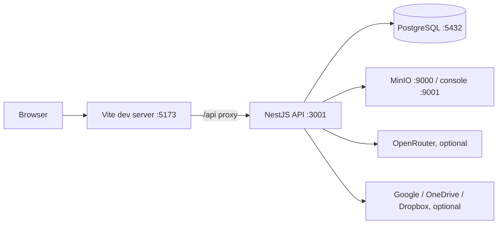

# Development Guide

Local development runs the NestJS API and the Vite React app on your machine, with PostgreSQL and MinIO from Docker Compose. [`mask`](https://github.com/jacobdeichert/mask) (tasks in `Maskfile.md`) wraps the common flows; every task also has a plain `npm` equivalent.


```mermaid
flowchart LR
    Browser[Browser] --> Web[Vite dev server :5173]
    Web -->|/api proxy| API[NestJS API :3001]
    API --> DB[(PostgreSQL :5432)]
    API --> MinIO[MinIO :9000 / console :9001]
    API --> OpenRouter[OpenRouter, optional]
    API --> OAuth[Google / OneDrive / Dropbox, optional]
```

## Prerequisites

- Node.js 22 (the version used by the Dockerfiles and CI)
- Docker with Docker Compose
- `mask` (optional)

## Quick Start

```bash
mask build   # install server and web dependencies (--clean reinstalls from scratch)
mask run     # start the whole stack
```

`mask run` starts PostgreSQL and MinIO, waits for the database, applies pending migrations, seeds test data if the `users` table is empty, then starts the API in watch mode and the Vite dev server. `mask run --kill` first stops stray Node processes.

| Surface | URL |
|---|---|
| Web app | `http://localhost:5173` |
| API | `http://localhost:3001` |
| Swagger UI | `http://localhost:3001/api-docs` |
| PostgreSQL | `localhost:5432` |
| MinIO API / console | `http://localhost:9000` / `http://localhost:9001` |

### Without mask

```bash
cd thoughty-server && npm install && cd ../thoughty-web && npm install && cd ..
docker compose -f infra/compose/compose.yaml up -d db minio
npm run migrate
npm run seed
cd thoughty-server && npm run dev    # terminal 1
cd thoughty-web && npm run dev       # terminal 2
```

Start only `db`, `minio`, and the API when you are working on the backend alone.

### VS Code Dev Container

`.devcontainer/` provides an `app` workspace container (Node 22, `mask`, `git`, `postgresql-client`, the GitHub CLI, and the project's recommended extensions) plus `db` and `minio` services gated on health checks. Dependencies install automatically, ports `3001`, `5173`, `5432`, `9000`, and `9001` are forwarded, and the container already sets `POSTGRES_HOST=db`, `S3_ENDPOINT=http://minio:9000`, and matching credentials, so no `.env` is needed. Because the services already run, start the app with the manual commands (`npm run migrate`, `npm run seed`, then the two `npm run dev` commands) instead of `mask run`. Do not override `POSTGRES_HOST` or `S3_ENDPOINT` in a local `.env`.

## Configuration

`thoughty-server/.env.example` and `thoughty-web/.env.example` are the reference for every variable. The defaults match the Compose stack, so copy them only to change a default or enable an optional integration.

| Server variable(s) | Local default | Notes |
|---|---|---|
| `POSTGRES_*` | `localhost:5432`, `postgres` / `password`, database `journal` | matches `infra/compose/compose.yaml` |
| `POSTGRES_READ_REPLICA_*` | unset | optional read replicas; see [Data Model](./data-model.md#read-replicas) |
| `JWT_SECRET`, `REFRESH_SECRET` | local placeholders | required; use real secrets anywhere shared |
| `TWO_FACTOR_SECRET` | local value | HMAC key for 2FA codes; one value across replicas |
| `CONFIG_ENCRYPTION_SECRET` | local value | encrypts provider tokens and personal AI keys; required in production |
| `FRONTEND_URL` | `http://localhost:5173` | used in email links |
| `CORS_ORIGIN` | `http://localhost:5173,http://localhost:3000` | comma-separated |
| `S3_*` | local MinIO | attachment storage |
| `REDIS_URL` or `REDIS_HOST` | unset | shared rate-limit counters; in-memory when unset |
| `OPENROUTER_API_KEY` | empty | optional shared AI key; users can add their own in Profile |
| `OPENROUTER_EMBEDDING_MODEL`, `OPENROUTER_TRANSCRIPTION_MODEL` | `openai/text-embedding-3-small`, `openai/whisper-large-v3` | optional overrides |
| Google Drive, OneDrive, Dropbox client IDs/secrets | empty | needed only for cloud sync |
| `SMTP_*` | placeholders | needed only to send real email; otherwise reset links are logged |
| `FEATURE_FLAG_PROVIDER_URL`, `FEATURE_FLAG_PROVIDER_TOKEN`, `FEATURE_FLAG_CACHE_TTL_MS`, `FEATURE_FLAGS` | unset | external flag provider, or a static `flag=true,other=false` fallback |
| `REQUEST_BODY_LIMIT` and friends | `1mb` JSON / `256kb` form | see [Security](./security.md#abuse-controls) |

The web app calls the API through relative `/api` paths proxied by Vite, so its only variable is `VITE_GOOGLE_CLIENT_ID` for Google sign-in.

## Everyday Commands

| Command (from the repository root) | Does |
|---|---|
| `npm run migrate` | apply pending migrations |
| `npm run seed` | load development data |
| `npm run check-db` | check database connectivity and schema assumptions |
| `npm run nuke-db` | drop the database contents (follow with `migrate` and `seed`) |
| `npm run kill` | stop stray backend Node processes |
| `npm run api:sync` | export the server's OpenAPI document and regenerate the web API types |
| `npm run coverage` | run both coverage suites (same as `mask test --coverage`) |

| Command | Does |
|---|---|
| `cd thoughty-server && npm run cloud-sync-worker` | run the sync worker from TypeScript for debugging |
| `cd thoughty-server && npm run db:validate-seed` | validate seed data without writing |
| `cd thoughty-server && npm run migration:generate -- src/database/migrations/<Name>` | generate a migration candidate |
| `cd thoughty-server && npm run migration:revert` | revert the latest migration (development only) |
| `cd thoughty-web && npm run typecheck` | type-check without building |

Tests are covered in the [Testing Guide](./testing.md).

## Changing the API

Backend DTOs and controllers are the source of truth for the API contract ([ADR 0004](./adr/0004-openapi-as-contract-source.md)). After changing a route or DTO, run `npm run api:sync` and commit both `thoughty-server/openapi/openapi.json` and `thoughty-web/src/generated/openapi.d.ts`. Every product endpoint must be called by the frontend; `cd thoughty-web && npm run api:usage` enforces it.

## Changing the Schema

Schema changes need a new timestamped migration in `thoughty-server/src/database/migrations` (TypeORM `synchronize` is off). Generate a candidate against an up-to-date local database, review both `up` and `down`, apply it with `npm run migrate`, and test fresh and upgraded databases. Never edit a migration that may have run elsewhere. Reverting the initial baseline migration drops the whole schema, so only do it with a backup. See [Data Model](./data-model.md#schema-migrations).

## Adding Text to the UI

All user-facing strings go through `t('key')`. Add the key to the `TranslationKey` union and to both the English and French maps in `thoughty-web/src/utils/translations.ts`; the type checker rejects a key missing from either language.
