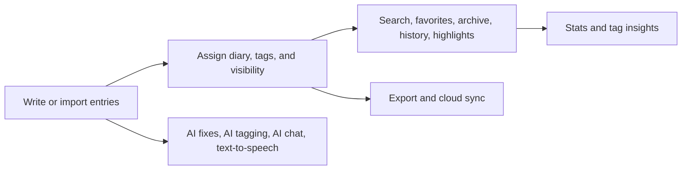

# Features

Thoughty is a privacy-focused journaling application built around dated entries, multiple diaries, and a workflow that makes it easy to capture, organize, revisit, and export long-lived personal writing. The core model is entry-first: writing, tags, visibility, history, highlights, statistics, and sync all build on the same journal record rather than living in disconnected tools.

## Entry-Centered Journaling

- Entries support both plain text and Markdown formats. Markdown entries get a formatting toolbar, inline help, and live preview, while plain-text entries stay lightweight for fast capture.
- The editor grows with the content instead of forcing a small fixed writing box, which keeps longer entries readable during drafting and editing.
- Multiple entries can exist on the same day. Thoughty keeps them addressable with date-plus-index references such as `[[2024-01-15]]` and `[[2024-01-15#2]]`.
- Entries can be backdated from the UI, edited inline, and updated without leaving the journal view. Date, tags, visibility, and other metadata are treated as part of the entry workflow rather than a separate settings surface.
- Same-day entries can be drag-reordered, which matters for users who use one date as a container for several shorter notes, check-ins, or event logs.
- Larger entry sets can be handled through a bulk-selection mode. Selected entries can be deleted, made public/private, archived/unarchived, tagged, moved to another diary, or rephrased with AI in one workflow.
- Stable entry permalinks use query-driven navigation such as `?entry=<id>`, so a specific entry can be reopened directly instead of relying on scroll position alone.
- Entries can also be shared directly from the journal. Thoughty uses the browser share sheet when it is available and falls back to copying the permalink when it is not.
- Primary entry actions are now cleaner thanks to a dedicated `More actions` menu, which keeps the main toolbar focused on visibility, favorite, and edit while moving secondary or destructive actions out of the way.
- Cross-reference navigation is not just link parsing. Referenced entries are opened in context, highlighted, and can return the user to the originating entry.
- Visibility is managed per entry with public and private states, making Thoughty usable for both strictly personal notes and selectively shareable writing.
- Favorites, archive state, and revision history are all first-class entry behaviors. Edited entries keep a history trail, and individual revisions can be inspected and removed.
- Attachments are handled inline: files can be attached to entries; image, audio, PDF, and text-like assets can be previewed in place; and larger previews open in a dedicated dialog rather than forcing blind downloads.
- Journal navigation includes paging plus a year/month jump control, so users can move to the first entry in a period without manually paging through long histories.

## Diaries and Long-Term Structure

- Journals are split into user-defined diaries rather than one undifferentiated timeline. This supports separate spaces for daily notes, work logs, dream journals, or any other writing stream.
- Diaries can be reordered, renamed, decorated with emoji icons, and assigned accent colors, which turns the diary switcher into a meaningful navigation layer instead of a plain list.
- An `All Diaries` view keeps cross-diary browsing possible without flattening the underlying structure.
- Each diary carries its own default visibility, so new entries and some imported entries inherit sensible defaults from the context they are created in.
- A default diary can be configured for faster capture, reducing the amount of per-entry setup needed for recurring workflows.
- Deleting a non-default diary does not strand its entries. They are moved to the current default diary, and the default diary itself is protected from deletion.
- Favorites are also exposed as a dedicated journal view, which gives saved entries a persistent home beyond a temporary filter.
- Diary management supports both drag-based reordering and keyboard arrow reordering from the manager, so the saved order can be adjusted without relying only on pointer input.

## Tags, Filtering, and Retrieval

- Tags are multi-valued and integrated directly into entry creation and editing. Existing tags autocomplete, but new tags can also be introduced inline without leaving the current draft.
- Tag presentation is richer than a flat label list. Tags can carry a color and an optional category, and that metadata is reused across chips, pickers, lists, and statistics.
- Category-aware sorting helps large tag sets stay usable. In practice, this means related tags can be grouped visually without changing the entry data model.
- Tag metadata is global enough to support whole-app rename operations. Renaming a tag updates entries across the journal rather than creating parallel old/new variants.
- Filtering is composable. Users can combine full-text search, multi-tag filters, date filtering, visibility state, archive state, and diary scope instead of being limited to one filter at a time.
- Search results highlight matches in both plain-text and Markdown-backed content, which makes the results useful for scanning instead of just locating candidate entries.
- The app includes a dedicated Tags view, so tags are not only an input mechanism for entries but also a browsing surface in their own right.

## Highlights and Insight Surfaces

- The stats area is built for journal review, not just raw counts. It exposes totals and averages, entry volume over time, top tags, and tag usage trends across years.
- A journaling activity heatmap adds a calendar-style view of writing frequency on the stats page, making active and quiet periods easy to spot at a glance.
- Diary scoping carries into stats, which is important when users want to compare a focused writing stream against the full journal.
- Tag metadata also feeds the insight layer, so charts and tag breakdowns can stay visually consistent with the colors used elsewhere in the app.
- Longer time ranges are paged instead of silently truncated, and the tag analysis includes a year-by-year top-tag breakdown alongside the charts.
- Highlights provide two different memory cues: a random entry for rediscovery and an `On This Day` view that groups matching entries by how many years ago they were written.
- Highlight results are actionable. They link back into the full journal flow rather than trapping the user in a read-only summary screen.

## Import, Export, and Portability

- Export is not limited to one archival format. Thoughty supports TXT, JSON, and Markdown output, with optional diary scoping and optional inclusion of visibility metadata.
- TXT import/export can be customized with saved format settings such as date format, entry separators, and same-day separators.
- Export filenames are generated for the chosen scope and format, which makes exports usable as real artifacts rather than anonymous downloads.
- Import accepts TXT, JSON, and Markdown content and performs format detection before commit, so users do not need to pre-classify files correctly by hand.
- Import is preview-first. Parsed entries are shown before they are written, duplicate candidates are identified up front, and the eventual import result reports how much was imported or skipped.
- Diary mapping is handled as part of the import/export path. When diary names do not align cleanly, Thoughty falls back safely instead of silently dropping content.
- Markdown preservation is treated seriously enough to keep formatting semantics across round trips, rather than collapsing everything into plain text.
- The import/export screen is route-aware, so selected diary, section, format, and visibility options can be encoded in the URL and reopened consistently.
- The import/export area also includes a guarded danger-zone action for deleting all entries in the current scope, with a confirmation step before the destructive request is sent.

## Cloud Sync and External Storage

- Thoughty supports Google Drive, OneDrive, and Dropbox as separate cloud sync providers. They can be connected independently rather than forcing a single-provider account model.
- Provider connection uses OAuth popup flows, keeping the journal session inside the app while delegating credentials to the provider.
- Cloud sync builds on the export system instead of inventing a second serialization format. That means diary scope, export format, and visibility options can be reused when pushing journal data to cloud storage.
- Users can browse provider files, import journal data back from the cloud, and download synced files to the local device when needed.
- Scheduled sync is configurable per provider with `every_6h`, `every_12h`, `daily`, and `weekly` frequencies.
- Scheduled sync is designed to avoid redundant uploads by detecting whether content has changed since the last successful run.
- Manual `Sync Now` remains available, which is important for people who want explicit control before travel, backup, or device changes.
- Provider tokens are stored in encrypted user config with refresh support, so long-lived integrations do not depend on repeated sign-in.

## AI Assistance and Accessibility

- AI features are built around OpenRouter and are opt-in at the infrastructure level: the server must be configured with an API key, and each user can choose a preferred model from profile settings.
- `Fix Writing` sends draft content to the configured model to correct grammar, spelling, and punctuation while aiming to preserve the original meaning and tone, and it now supports grammar, polish, and rewrite modes.
- Tone and mood analysis adds a higher-level journal insight surface that summarizes dominant mood and tone, includes breakdowns for each, and produces a short written summary across analyzed entries.
- AI tag suggestions are available on demand, and automatic AI tagging can also run during create or update flows when the configured per-user tag limit is greater than `0`.
- Entry-specific AI chat turns an existing journal entry into the context for a conversation, which is useful for reflection, analysis, and follow-up questions rather than generic chatbot use.
- AI chat history is stored per entry on the server, so reopening the same entry restores the prior conversation instead of starting from an empty modal on each device or browser.
- The AI chat modal can export the current conversation as a plain-text transcript that includes entry metadata and the full message history.
- Text-to-speech can read entries aloud through the browser speech synthesis API, with language-aware voice selection and an option to include entry dates in the spoken output.

## Accounts, Profile, and Preferences

- Authentication supports email/password sign-up plus Google OAuth sign-in. Existing accounts can be linked when the same email is used, which reduces account fragmentation.
- Login accepts either email or username, while access and refresh tokens handle authenticated sessions and silent token renewal.
- Account recovery and security flows include forgot-password email delivery, password change with current-password verification, and refresh-token invalidation when credentials change.
- Account deletion is soft-delete oriented and guarded by confirmation, which is safer than immediate irreversible removal.
- GDPR-style data download is available from the config surface, allowing a user to export their stored account data in one response.
- Profile management includes full name, display name, bio, birthday, avatar, and membership metadata.
- Avatar editing goes beyond simple upload. Users can crop, zoom, and reposition images within a circular editor before saving the final result.
- Preferences cover theme, language, journal pagination size, profile birthday/gender metadata, text-to-speech date reading, preferred AI model, and the automatic AI tagging limit.
- Appearance preferences now include font family, font size, and font color controls, which let users tune the journal to their reading comfort.
- Text-to-speech appearance settings now include voice selection and a preview action, so users can listen to the chosen voice before saving it.
- English and French are the currently implemented application languages, and language selection is stored as part of the user configuration.

## Product Experience

- Unauthenticated visitors land on a dedicated intro page rather than being dropped straight into a bare login form.
- The app uses route-based navigation across `/journal`, `/stats`, `/profile`, `/tags`, and `/import-export`, which makes major areas linkable and easier to revisit.
- Long journal pages include a back-to-top affordance so users can quickly return to the main controls after browsing older entries.
- Destructive flows use confirmation dialogs, and long-running operations such as loading history, sync, or imports expose explicit loading states.
- The layout is responsive across desktop and smaller screens, with the same core journaling surfaces preserved instead of maintaining a separate reduced mobile product.
- Footer links expose privacy, terms, and contact entry points, rounding out the application as a real hosted product rather than only an internal tool.