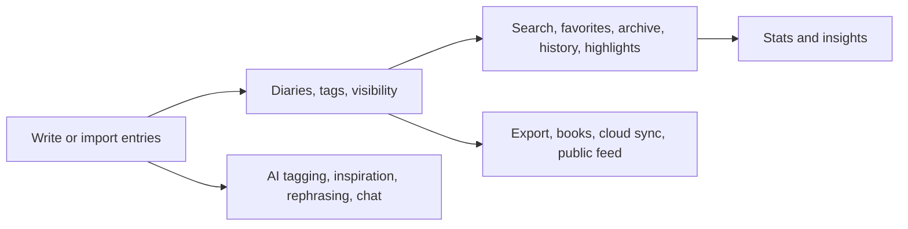

# Features

Thoughty is a privacy-focused journal built around dated entries. Writing, tags, diaries, history, statistics, AI help, and sync all operate on the same entry record rather than living in separate tools. The implemented and planned backlog is tracked in [TODO.md](../TODO.md).

```mermaid
flowchart LR
	Capture[Write or import entries] --> Organize[Diaries, tags, visibility]
	Organize --> Revisit[Search, favorites, archive, history, highlights]
	Revisit --> Understand[Stats and insights]
	Organize --> Share[Export, books, cloud sync, public feed]
	Capture --> Assist[AI tagging, inspiration, rephrasing, chat]
```

## Writing and Entries

- **Composer.** Plain-text or Markdown entries (with a formatting toolbar, inline help, and live preview) in a box that grows with the content and can also be resized by dragging (the entry editor behaves the same). The date defaults to today and accepts typed dates for backdating. Attachments, visibility, and AI actions sit next to Save.
- **Templates.** Thirteen built-in templates covering daily practice (gratitude, daily reflection, morning intentions, weekly review, life check-in), thinking things through (decision notes, philosophical musing, values reflection), emotions (rant it out, worry check, unsent letter), and more (letter to my future self, dream log), plus user templates saved from the current draft. Choosing one fills the draft, tags, format, and visibility.
- **Several entries per day.** Entries are addressed by date and same-day index; same-day entries can be drag-reordered and are renumbered automatically.
- **Cross-references.** Writing `[[2024-01-15]]` or `[[2024-01-15#2]]` links to another entry. Links open the target in context, highlight it, and offer a way back. Each entry lists the entries that reference it (backlinks) when there are any.
- **Entry actions.** Visibility, favorite, pin, listen, chat, rephrase, and edit are one click away; share, summarize, history, archive, and delete live in a **More actions** menu. Sharing uses the browser share sheet or copies a stable permalink (`?entry=<id>`).
- **Entry states.** Favorites (with their own journal view), pinned entries (kept on top, up to a configurable limit), archive, and per-entry public/private visibility.
- **Revision history.** Every edit keeps the previous version; revisions can be viewed and deleted individually.
- **Attachments.** Files upload to S3-compatible storage. Images, audio, PDFs, and text files preview inline, with larger previews in a dialog. Audio notes can be transcribed on demand; the transcript is cached on the attachment and can be copied.
- **Bulk mode.** Select many entries to delete, change visibility, archive or unarchive, add tags, move to another diary, or rephrase with AI.
- **Reading aids.** Each entry shows its word count and estimated reading time. Text-to-speech reads entries aloud with language-aware voice selection, a voice preview, and optional reading of dates.
- **Navigation.** Pagination with a configurable page size and go-to-page box, a year/month jump control, a Back to top link, and keyboard shortcuts: `Ctrl+N` (new entry), `Ctrl+/` (search), `Esc` (close dialogs), and left/right arrows (pages).

## Diaries

- Separate diaries for different writing streams, each with a name, emoji icon, accent color, and default visibility for new entries.
- An **All Diaries** view for browsing across them, and a configurable default diary for quick capture.
- Reordering by drag or by keyboard in the diary manager.
- Deleting a diary moves its entries to the default diary; the default diary itself cannot be deleted.
- The selected diary scopes the journal, stats, AI features, import/export, and books.

## Tags, Search, and Filters

- **Tags are the single way to organize entries.** Concrete subjects and broader themes are both just tags. Existing tags autocomplete in the composer, editor, and filters, and new tags can be typed inline.
- **Tags view (full CRUD).** Create a tag before any entry uses it (it is immediately offered in the pickers); see how many entries use each tag; rename a tag across the whole journal; set a color and an optional category (used for grouping and sorting everywhere tags appear); and delete a tag, which removes it from every entry after confirmation but keeps the entries. New and imported tags get a distinct color automatically.
- **Organize journal tags.** From the Tags view, AI can propose a compact set of tags for the whole journal and assign them to entries; every assignment is reviewed before anything is saved (see [AI](#ai-assistance)).
- **Filter bar.** Three groups: search (keyword or meaning-based, plus tags), filters (date, visibility, archive state, favorites, reset), and tools (Highlights and Find duplicates). All filters combine with each other and with the diary scope. The date picker only offers dates that have entries. Keyword matches are highlighted in plain-text and Markdown entries.

## Highlights and Insights

- **Highlights:** a random entry to rediscover and an **On This Day** view grouped by how many years ago each entry was written. Results link back into the journal.
- **Stats:** totals and averages (entries, unique tags, years active, entries per year, words and reading time per entry), entries per year and per month, top tags, and top tags per year, all scoped to the selected diary and colored with tag metadata. Long ranges are paged, not truncated.
- **Activity heatmap:** a calendar of writing frequency; selecting a day opens it in the journal.
- **Connections graph:** the 12 strongest entry-to-entry links (scored by shared tags) and tag co-occurrences in the selected scope, computed locally without AI; selecting an entry opens it.
- **AI insight panels:** mood and tone, recurring subjects, and an on-demand writing-tendency analysis (see [AI](#ai-assistance)).

## Import, Export, and Books

- **Export** to TXT, JSON, Markdown, and CSV (with word count and reading time columns), or to PDF, EPUB, and HTML documents with a title page, table of contents, and one section per month. Exports can be scoped to a diary and can include visibility. Filenames reflect the scope and format.
- **TXT format settings** (date format, prefix and suffix, entry and same-day separators, tag brackets and separator) are saved and reused for import and export.
- **Import** accepts TXT, JSON, and Markdown, detects the format automatically, previews parsed entries, flags duplicates with an option to skip them, and reports what was imported or skipped. Imported entries use the target diary's default visibility unless visibility is included. Markdown formatting survives round trips.
- **Danger zone:** delete all entries in the current scope, behind a confirmation.
- The Import/Export page encodes its diary, section, and format choices in the URL.

### Book converter

- Turns a diary or the whole journal into a book in which each tag is a chapter. By default AI weaves each chapter's entries into first-person prose that connects the thoughts and smooths the language without inventing or dropping anything; long chapters are written in sequential parts. Without AI, chapters list the entries chronologically.
- Optional AI chapter introductions and closing summaries, grounded in the source entries.
- Options: title and author, chapter order (alphabetical, entry count, or first date), date range, which tags become chapters, whether multi-tag entries appear in every matching chapter or only the first, an untagged chapter, entry dates, a table of contents, and a **yearbook** mode with one chapter per year or month.
- Covers: four color palettes and an optional PNG or JPEG image (up to 2 MB, validated by file signature, embedded in the output).
- Entry images can be included: PNG and JPEG in every format, GIF and WebP in Markdown, HTML, and EPUB, within a 5 MB per-image and 25 MB total budget.
- Output: PDF (title page, table of contents with page numbers, outline, page footers), EPUB 3, printable HTML, and Markdown. Archived entries are excluded.
- **Preview Chapters** shows the outline (chapters, entry counts, date ranges) without spending AI tokens.
- **Versions:** save the generated book as version 1, then later versions from current entries and settings; history shows added entries and chapters, and every version stays downloadable. Histories are separate per diary and for all diaries.
- Books can be uploaded directly to a connected cloud provider.

## Cloud Sync

- Google Drive, OneDrive, and Dropbox connect independently through OAuth popups; their tokens are stored encrypted and refreshed automatically.
- Upload an export (reusing the export scope, format, and visibility options), browse provider files, import journal files from the cloud, and download synced files.
- Scheduled sync per provider every 6 hours, 12 hours, day, or week, skipping uploads when nothing changed, plus a manual **Sync Now**.

## Social

- **Feed:** a paginated, infinitely scrolling timeline of other users' public entries, a **Following** tab limited to the authors you follow, and a **My public entries** tab that previews exactly what others can see of your journal. Private, archived, moderated, and deleted-account content never appears.
- **Follows:** follow or unfollow an author from any of their feed entries. The **Following** tab lists the people you follow (with a quick unfollow) and shows how many people follow you. Follows are included in the personal data download.
- **Comments:** every feed entry has a comment thread showing its count. Signed-in users can comment (up to 1,000 characters of plain text) on any entry in the feed, delete their own comments, and remove any comment left on their own public entries after a confirmation. Comments are included in the personal data download.
- **Likes:** like or unlike any entry or comment in the feed written by someone else; your own entries and comments show their like count. Likes are included in the personal data download.
- **Leaderboard:** opened from the Feed header (`/feed?view=leaderboard`), it ranks the ten most active writers (public entries published), the most liked entries, and the most commented entries for this week, this month, this year, or all time. Only content the feed can show counts, and authors' own comments on their entries are ignored.
- **Feature requests:** a public board of ideas ranked by votes. Anyone can browse; signed-in users can submit ideas and vote once per idea (authors vote for their own idea automatically).

## AI Assistance

AI runs through OpenRouter. A deployment can provide a shared key, and each user can add a personal key in Profile, which then takes precedence for all their AI requests; removing it falls back to the shared key. Personal keys are write-only (only a short suffix is shown), and Profile shows a 30-day usage dashboard with tokens, requests, and costs, plus the key's spend, limit, and remaining balance from OpenRouter. Users pick a default model and optional per-task models (tags, writing fixes, entry chat, tone analysis, summaries, Get Inspired, book weaving). What each feature sends to the provider is listed in [Security](./security.md#ai-privacy).

- **Auto Tag:** suggests tags for the draft covering both concrete subjects and the broader themes behind them, added alongside the tags already chosen. When the **Automatic Tag Limit** is above 0, entries are also tagged this way automatically on save.
- **Get Inspired:** asks one deep, reflective question based on your most-used tags and the tags of your recent entries in the current diary. Ask for another question, or choose **Write about this** to add it to the draft.
- **Rephrase:** rewrites the draft or an existing entry in one of three modes: grammar and form only, light style polish, or complete rewrite.
- **Summaries:** summarize a long entry, optionally emphasizing or leaving out chosen details; results can be regenerated and copied.
- **Entry chat:** discuss an entry with AI. The conversation is saved per entry on the server and can be exported as a text transcript.
- **Meaning search:** find entries by idea rather than keywords among the 100 newest in scope; the top 20 matches still combine with every other filter.
- **Find duplicates:** reviews the 40 newest entries in scope for pairs sharing both a subject and a conclusion. Results are review-only; removing an entry goes through the normal delete confirmation.
- **Organize journal tags:** proposes at most 12 tags and up to three per entry for the 300 newest entries; you review every assignment and choose whether to add them or replace existing tags.
- **Insights:** mood, tone, and recurring subjects across the 40 newest entries in scope, and an on-demand writing-tendency analysis over any date range that sends only aggregate metrics, not text. Results describe writing patterns and are explicitly non-clinical.
- **Audio transcription:** transcribe an attached audio note.

## Accounts and Preferences

- Sign-in: in production through the shared Keycloak single sign-on; locally with email or username and password, or Google (linked to an existing account with the same email).
- Security: email verification, optional email two-factor authentication, password change and reset, active session management (sign out one or all other sessions), and account deletion with confirmation.
- Profile: full name, display name, bio, birthday, gender, and an avatar editor with crop, zoom, and repositioning; a verified badge for confirmed accounts.
- Data: download all your data as JSON.
- Subscription: plan selection, payment method label, and billing history.
- Appearance: light or dark theme, high contrast, font family, size, and color with a live preview, entries per page, and pinned-entry limit.
- Languages: English and French.
- Runtime feature flags can be served by an external provider and change behavior without a redeploy.

## Accessibility and Experience

- Skip links, a single main landmark, and focus moved to the content after every route change.
- Every public and signed-in page is scanned with Axe against WCAG 2.0, 2.1, and 2.2 A/AA in both themes as part of the end-to-end suite.
- Keyboard access to all interactive elements, including diary reordering and entry reordering.
- Responsive layout: the same features on desktop and phone, with controls that wrap rather than scroll off-screen.
- Destructive actions ask for confirmation, long operations show progress, and API errors are turned into readable messages.
- Signed-out visitors get a landing page with feature highlights and screenshots, plus About, Blog, Privacy, Terms, Contact, and Feedback pages.

## Future Direction: Life ERP

Thoughty may grow into a personal ERP while keeping its privacy, portability, and entry-centered design: a document vault, life metrics and habits, finances, health, relationships, productivity, dashboards that correlate them with the journal, and importers for existing spreadsheets. The concrete backlog is in [TODO.md](../TODO.md#life-erp).
