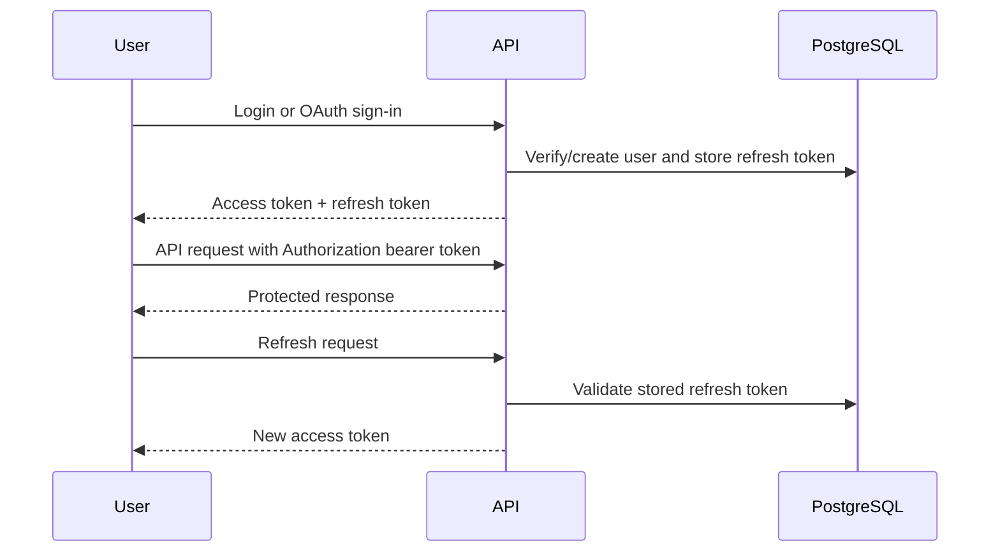

# Security and Privacy Reference

Thoughty stores personal journal content, profile data, attachments, refresh tokens, and encrypted third-party provider tokens. This guide summarizes the current security model for contributors and operators.

## Security Posture Summary

- API routes are protected by default through a global JWT guard.
- Public routes must be explicitly marked with `@Public()`.
- A global throttling guard applies baseline abuse protection, with stricter limits on sensitive auth flows.
- JSON and URL-encoded request parsers enforce explicit body size limits before DTO validation.
- Signup and login forms include a hidden bot-trap field that rejects automated submissions when filled.
- Production responses use a nonce-based Content Security Policy without `unsafe-inline` script or style fallbacks.
- DTO validation uses whitelisting and rejects unexpected fields.
- User-controlled text and attachment filenames are sanitized in relevant flows.
- Passwords are hashed with bcrypt.
- Password reset tokens are hashed before storage.
- Cloud provider tokens are encrypted at rest with AES-256-GCM using `CONFIG_ENCRYPTION_SECRET`.
- Production secrets are expected to come from Vault-backed environment injection.

## Authentication and Sessions

Thoughty uses bearer-token authentication.

```mermaid
sequenceDiagram
    participant User
    participant API
    participant DB as PostgreSQL

    User->>API: Login or OAuth sign-in
    API->>DB: Verify/create user and store refresh token
    API-->>User: Access token + refresh token
    User->>API: API request with Authorization bearer token
    API-->>User: Protected response
    User->>API: Refresh request
    API->>DB: Validate stored refresh token
    API-->>User: New access token
```

Refresh tokens are treated as active sessions. Authenticated users can list active sessions without exposing token values, revoke a non-current session by ID, or revoke all other sessions while keeping the current refresh token active. Refresh tokens are also revoked when sensitive account lifecycle events occur, including password changes, password resets, explicit logout, and account deletion.

## Public Routes

Public routes are exceptions to the default protected API model. They should remain few and deliberate.

Known public route categories include:

- health checks
- signup/login/OAuth entry points
- password recovery entry points
- any explicitly documented public product surface added in the future

When adding a public endpoint, document why it must be public, what throttling applies, and what information it can reveal to unauthenticated callers.

The social feed is not an unauthenticated public endpoint. `GET /api/entries/feed` requires a valid account session, validates `scope`, `page`, and `limit`, caps pages at 20 entries, and returns only a narrow author projection (`id`, `username`, and `avatarUrl`). Community reads exclude the requester; personal previews include only the requester's own eligible public entries. Both scopes require public visibility, visible moderation state, an active entry, and a non-deleted author.

Entry visibility records the author's sharing intent. The independent `moderation_status` records platform enforcement and must never be writable through ordinary entry create or update DTOs. Current values are `visible`, `hidden`, `under_review`, and `removed`; only `visible` content is feed eligible.

## Content Security Policy

Production Helmet middleware sets a per-response nonce and uses that nonce in `script-src` and `style-src`. HTML responses, including Swagger UI, have the nonce applied to generated `<script>` and `<style>` tags before they are sent.

Do not reintroduce `unsafe-inline` for scripts or styles. If a future page needs inline assets, route them through the nonce helper or move them to external bundled assets.

## Rate Limiting

Current limits are documented in ADR 0009:

- general default: `100` requests per `15` minutes
- register: `5` requests per `15` minutes
- login: `5` requests per `15` minutes
- OAuth login: `5` requests per `15` minutes
- refresh token: `30` requests per `15` minutes
- forgot password: `3` requests per hour
- reset password: `3` requests per hour
- change password: `5` requests per hour
- delete account: `5` requests per hour

The current throttling model is process-local. In multi-replica or higher-risk deployments, shared throttling storage should be introduced instead of weakening endpoint limits.

## Request Payload Limits

The API disables Nest's implicit body parser and registers explicit parser limits:

- JSON requests default to `1mb`.
- URL-encoded form requests default to `256kb`.
- `REQUEST_BODY_LIMIT` overrides both parser defaults.
- `REQUEST_JSON_BODY_LIMIT` and `REQUEST_FORM_BODY_LIMIT` can override each parser individually.

Attachment uploads keep their separate Multer file-size limit.

## Secrets

Never commit real secrets. Production-like deployments should provide these through Vault or equivalent secret injection:

- `JWT_SECRET`
- `REFRESH_SECRET`
- `TWO_FACTOR_SECRET`
- `CONFIG_ENCRYPTION_SECRET`
- PostgreSQL credentials
- S3/object-storage access keys
- OpenRouter API key
- OAuth provider client secrets
- SMTP credentials

`CONFIG_ENCRYPTION_SECRET` is especially sensitive because it protects encrypted user integration settings such as cloud provider tokens.

## Attachments

Attachment security relies on both application checks and object-storage configuration.

- Validate MIME types and size limits before storage.
- Store generated object keys separately from original filenames.
- Serve files through application endpoints rather than exposing arbitrary object keys directly.
- Sanitize requested filenames before object retrieval.
- Keep bucket access private unless a future ADR explicitly changes the sharing model.

## AI Privacy

AI features are optional and can use either a deployment-wide OpenRouter key or a user-provided personal key. A personal key always takes precedence for that authenticated user. It is validated against OpenRouter before storage, encrypted at rest with AES-256-GCM using `CONFIG_ENCRYPTION_SECRET`, accepted only through dedicated authenticated endpoints, and never returned in full. General configuration reads and writes and GDPR data exports explicitly exclude it.

When enabled, relevant journal content may be sent to OpenRouter or the configured model provider for operations such as writing fixes, tag suggestions, writing prompts, entry summaries, mood/tone analysis, entry-specific chat, and explicitly requested audio-note transcription. Audio transcription sends only the authenticated user's selected audio attachment, enforces the existing 5 MB upload limit again while reading storage, and persists the returned transcript on that attachment. Entry summaries and writing prompts resolve journal history from the authenticated user ID on the server and treat journal text as untrusted source material rather than model instructions. Concrete and thematic tag suggestions also send the draft as structured, untrusted source material and instruct the provider not to follow directions embedded in journal text. Writing prompts use at most 12 recent entries from the selected diary or the user's full journal scope, with each excerpt capped at 800 characters.

Whole-journal theme organization is explicitly preview-first. The server sends at most the 300 newest non-empty owned entries to OpenRouter, caps each excerpt at 400 characters, treats all journal text as untrusted data, and exposes truncation in the review UI. The provider can propose at most 12 themes and three themes per entry. Applying a reviewed plan does not call the provider again: the server validates the bounded assignments, rechecks that every referenced entry belongs to the authenticated user before making changes, and only then adds or replaces tags for the selected entries.

Usage accounting stores one metadata-only event per successful OpenRouter response: user ID, credential source, model, token counts, cost, and timestamp. It never stores prompts or completions. The profile dashboard aggregates personal-key events over 30 days and separately reads the current key's spend and limit from OpenRouter; provider totals can include requests made outside Thoughty with the same key.

The Stats Connections graph is computed locally from the authenticated user's entry IDs, dates, indexes, and tags. It does not send journal data to an AI provider, include entry content in its response, or persist derived relationships. Diary filtering remains combined with user ownership in the database query, and each relationship list is capped at 12 results.

Product and deployment documentation should make this clear to users and operators. Future local-LLM support should be covered by a dedicated ADR because it changes privacy, hosting, and performance assumptions.

## Email Verification and Two-Factor Authentication

Email verification uses hashed, expiring tokens and is required before a password account can enable email two-factor authentication. Enabling 2FA sends a six-digit code to the verified address; password login then returns an opaque challenge instead of session tokens until that code is confirmed.

Two-factor challenge tokens are stored as SHA-256 hashes, codes are stored as HMAC-SHA-256 values, and both expire after ten minutes. Successful verification atomically clears the challenge so it cannot be replayed. Public verify and resend routes use the stricter authentication-attempt throttle, while setup, enable, disable, and status operations are authenticated. Set one strong `TWO_FACTOR_SECRET` value across all server replicas; when omitted, development falls back to a key derived from `JWT_SECRET`.

## Password Reset Email Behavior

Password reset tokens are hashed before storage and expire after one hour. The forgot-password endpoint intentionally returns a generic success response to reduce email enumeration risk.

In local or misconfigured email environments, the current email service path can fall back to logging the reset URL when SMTP delivery fails. That is useful for development, but production deployments should configure SMTP correctly and treat reset-link logging as sensitive operational output.

## Security Backlog

Important remaining work includes:

- Redis-backed distributed rate limiting for multi-replica deployments
- dependency vulnerability scanning in CI
- structured security audit logging for sensitive actions
- backup and disaster recovery implementation

## Review Checklist for Security-Sensitive Changes

- Does this introduce a new public route?
- Does it expose user-owned journal data, attachments, settings, or provider tokens?
- Does it need endpoint-specific rate limiting?
- Does it need a larger request body limit or a separate upload path?
- Does it preserve user scoping in database queries?
- Does it send journal content to a third party?
- Does it require a new secret or secret-rotation story?
- Does it require an ADR because it changes security or privacy assumptions?
