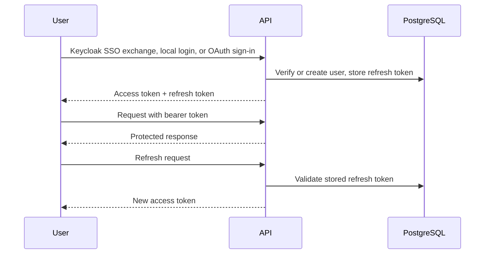

# Security and Privacy Reference

Thoughty stores personal journal content, profile data, attachments, sessions, and encrypted third-party credentials. This guide describes the security model contributors and operators must preserve. The decisions behind it are in [ADR 0008](./adr/0008-security-authentication-and-owasp-baseline.md) and [ADR 0009](./adr/0009-rate-limiting-and-abuse-controls.md).

## Baseline

- Every API route requires a JWT unless it is explicitly marked `@Public()`.
- DTO validation whitelists fields and rejects unexpected ones; ownership-scoped queries always filter by the authenticated user ID.
- User-controlled text and attachment filenames are sanitized where they are rendered or used.
- Passwords are hashed with bcrypt; reset, verification, and 2FA tokens are stored only as hashes.
- Cloud provider tokens and personal AI keys are encrypted at rest with AES-256-GCM using `CONFIG_ENCRYPTION_SECRET`.
- Production responses carry a per-response nonce Content Security Policy with no `unsafe-inline` scripts or styles; Swagger UI and other HTML get the nonce applied to their inline tags. Do not reintroduce `unsafe-inline`.
- Sign-up and login forms include a hidden bot-trap field that rejects automated submissions.
- Production secrets come from Vault; nothing secret is committed.

## Authentication and Sessions

Production sign-in goes through the shared Keycloak `swirlit` realm. The Ingress uses the platform's OAuth2 Proxy as an authentication gate and forwards its short-lived Keycloak access token to `GET /api/auth/sso`. The API verifies the RS256 signature, issuer, expiry, and `oauth2-proxy` audience against Keycloak's JWKS, then links the verified email to (or creates) the local Thoughty user and issues Thoughty's own access and refresh tokens, so authorization stays scoped to the local user ID. Identity headers are never trusted without that verification, and Thoughty never sees the Keycloak password. No Thoughty-specific Keycloak client is needed; this repository owns the Middleware, issuer/JWKS configuration, audience check, and local account lifecycle.

Local development keeps email/password and optional Google sign-in; login accepts an email or a username.

```mermaid
sequenceDiagram
    participant User
    participant API
    participant DB as PostgreSQL

    User->>API: Keycloak SSO exchange, local login, or OAuth sign-in
    API->>DB: Verify or create user, store refresh token
    API-->>User: Access token + refresh token
    User->>API: Request with bearer token
    API-->>User: Protected response
    User->>API: Refresh request
    API->>DB: Validate stored refresh token
    API-->>User: New access token
```

Refresh tokens are the active sessions. Users can list their sessions (token values are never returned), revoke one other session, or revoke all other sessions. Password changes, password resets, logout, and account deletion revoke refresh tokens. Accounts are soft-deleted after confirmation.

### Email verification and two-factor authentication

Verification links use hashed, expiring tokens. A verified password account can enable email 2FA; password login then returns an opaque challenge instead of tokens until the six-digit emailed code is confirmed. Challenge tokens are stored as SHA-256 hashes and codes as HMAC-SHA-256 values; both expire after ten minutes and are cleared atomically on success, so they cannot be replayed. Disabling 2FA requires the current password. Use one strong `TWO_FACTOR_SECRET` across all replicas (development falls back to a key derived from `JWT_SECRET`).

### Password reset

Reset tokens are hashed and expire after one hour. The forgot-password endpoint always returns the same generic response to avoid revealing which emails exist. If SMTP delivery fails, the email service logs the reset URL, which helps local development but makes those logs sensitive; production must have working SMTP.

## Public Surfaces

Public routes are deliberate exceptions: health checks, sign-up/login/OAuth entry points, email verification and password recovery, the public landing and legal pages, and the read side of the feature-request board. Any new public endpoint must document why it is public, which throttle applies, and what it can reveal.

The social feed is **not** public. `GET /api/entries/feed` requires a session, validates `scope` (`community`, `following`, or `mine`), `page`, and `limit` (at most 20 entries per page), and returns only `id`, `username`, `avatarUrl`, and whether the requester follows them for authors. An entry appears only when its visibility is `public`, its moderation status is `visible`, it is not archived, and its author is not deleted. `moderation_status` (`visible`, `hidden`, `under_review`, `removed`) is platform-controlled and must never be writable through entry create or update DTOs.

Follows (`/api/follows`) also require a session. `PUT /api/follows/:userId` answers `404` unless the target currently has a feed-eligible entry, so user ids cannot be probed for private or deleted accounts, and `400` for a self-follow. The follow list only exposes the same author fields as the feed plus the follow date; followers are only counted, never listed.

Comments (`/api/entries/:entryId/comments`) require a session and answer `404` unless the entry is feed-eligible, so private, moderated, archived, or deleted-author entries cannot be probed. Content is trimmed, limited to 1,000 characters, stored as typed, and always rendered as escaped plain text. Only the comment author or the entry owner can delete a comment; anyone else gets `404`.

Likes (`PUT`/`DELETE` `/api/entries/:entryId/like` and `/api/entries/:entryId/comments/:commentId/like`) follow the same eligibility rule, are idempotent, and refuse self-likes with `400` so like counts cannot be inflated by their author.

`GET /api/leaderboard` requires a session and only aggregates feed-eligible content, so private journaling activity never leaks into rankings; it ignores authors' comments on their own entries and interactions from deleted accounts, and returns plain-text excerpts of at most 280 characters with the same narrow author fields as the feed.

## Abuse Controls

Rate limits (`thoughty-server/src/common/rate-limit.constants.ts`):

| Policy | Limit | Applies to |
|---|---|---|
| Default | 100 per 15 min | every route |
| Auth attempts | 5 per 15 min | register, login, OAuth, 2FA verify/resend |
| Token refresh | 30 per 15 min | refresh |
| Password recovery | 3 per hour | forgot password, reset password, verify email |
| Account security | 5 per hour | password change, verification-email resend, 2FA setup/enable/disable, session revocation, account deletion |
| Social writes | 30 per 15 min | follow, unfollow, post and delete comments, like and unlike |

Counters are stored in Redis when `REDIS_URL` or `REDIS_HOST` is set, so limits hold across replicas; if Redis is unavailable each process falls back to local counters. Behind ingress, validate the trusted proxy and client-IP path before relying on per-client limits.

Request bodies are limited before validation: JSON `1mb` and URL-encoded `256kb` by default, overridable with `REQUEST_BODY_LIMIT`, `REQUEST_JSON_BODY_LIMIT`, and `REQUEST_FORM_BODY_LIMIT`. Uploads use separate per-file Multer limits.

Database errors caused by client input, such as an id beyond PostgreSQL's integer range, are answered with `400` by the global `DatabaseInputExceptionFilter` instead of surfacing as `500`.

## Secrets

Provided through Vault (see [Deployment](./deployment.md#configuration-and-secrets)) and never committed:

- `JWT_SECRET`, `REFRESH_SECRET`, `TWO_FACTOR_SECRET`
- `CONFIG_ENCRYPTION_SECRET` — the most sensitive value: losing it makes encrypted provider tokens and personal AI keys unreadable, and leaking it exposes them
- PostgreSQL credentials and the backup bucket credentials
- S3 access keys for attachments
- `OPENROUTER_API_KEY` (optional shared AI key)
- Google, OneDrive, and Dropbox OAuth client secrets
- SMTP credentials

## Attachments

- MIME type and size are validated before storage; uploads accept one file and at most one scalar field, and reject nested multipart field names before parsing.
- Objects are stored under generated keys (`stored_filename`), never the original filename.
- Files are served only through authenticated application endpoints; the frontend loads previews and downloads with authenticated requests and short-lived object URLs.
- Buckets stay private unless a future ADR changes the sharing model.

## AI Privacy

AI features are optional. A deployment may provide a shared OpenRouter key, and each user may add a personal key that then takes precedence for all of their AI requests. Personal keys are validated with OpenRouter before storage, encrypted at rest, accepted only through dedicated authenticated endpoints, shown only as a short suffix, and excluded from configuration responses and GDPR exports.

What each feature sends to the provider:

| Feature | Data sent |
|---|---|
| Rephrase, Auto Tag, entry chat | the draft or selected entry, as structured untrusted source material |
| Entry summary | one server-loaded entry owned by the user, plus the user's include/exclude guidance |
| Get Inspired | tag names and counts only, from at most the 200 newest entries in scope — never entry text |
| Mood, tone, and subject analysis | at most the 40 newest entries in scope |
| Duplicate review | at most the 40 newest entries in scope |
| Meaning search | the query plus at most the 100 newest entries in scope, for embeddings |
| Organize journal tags | at most the 300 newest non-empty entries, each capped at 400 characters |
| Writing-tendency analysis | bounded aggregate word, subject, and writing metrics computed locally — no raw text |
| Audio transcription | the single audio attachment the user selected (5 MB limit re-checked while reading storage) |

All prompts instruct the model not to follow instructions embedded in journal text or tag names. Journal tag organization is preview-first: applying a reviewed plan does not call the provider again, and the server rechecks that every referenced entry belongs to the user before changing tags. The Stats Connections graph is computed locally from entry IDs, dates, and tags, and never involves an AI provider.

Usage accounting stores one metadata-only row per OpenRouter response (user, credential source, model, token counts, cost, timestamp) and never prompts or completions. Local-LLM support would change these assumptions and needs its own ADR.

## Supply Chain and Runtime Hardening

- The pipeline's Trivy job scans dependencies (including development dependencies), IaC, and secrets and retains JSON/SARIF reports; it reports but does not gate releases. Releases publish immutable, checksummed archives and images. See [Delivery Pipeline](./deployment.md#delivery-pipeline).
- Server images pin Node 22 on Alpine with security updates applied and omit npm and Yarn from the runtime; the API, worker, and migration job run `node` directly. Web images apply Alpine updates to the pinned unprivileged NGINX image.
- Application workloads run as UID/GID 10001 with a read-only root filesystem, all capabilities dropped, the runtime seccomp profile, and explicit volumes for writable paths. Database helper jobs use the digest-pinned public PostgreSQL 18.6 image as UID 65534 without registry credentials.
- Dependency overrides are kept only when a transitive pin needs a security fix (currently Multer, so NestJS's upload middleware cannot keep an older vulnerable copy). Validate dependency changes with the backend tests, a production image build, and an image-level Trivy scan.

## Review Checklist for Security-Sensitive Changes

- Does it add a public route, and is its throttle appropriate?
- Does it expose journal data, attachments, settings, or credentials to anyone but the owner?
- Does every query stay scoped to the authenticated user?
- Does it send journal content to a third party, and is that listed above?
- Does it need a larger body limit or a separate upload path?
- Does it introduce a secret, and how is it rotated?
- Does it change security or privacy assumptions enough to need an ADR?
